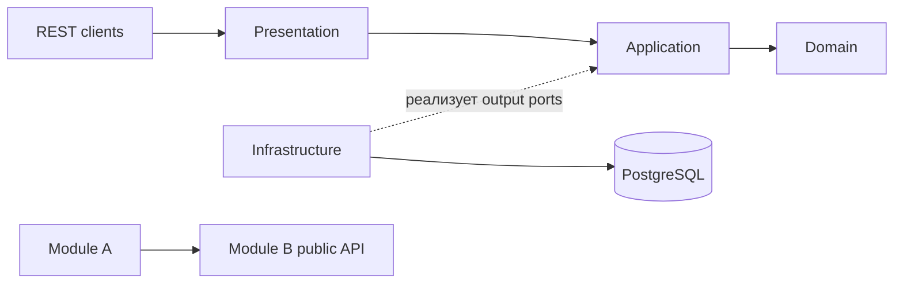

# Backend EdTech: архитектура и технологический стек

## Назначение документа

Этот файл — обязательный контекст для агента, который реализует backend EdTech. Он фиксирует границы системы, структуру модульного монолита, разрешённые зависимости, владение данными, технологический стек и общие правила разработки.

Документ описывает только backend. Выбор frontend-фреймворка в него не входит.

## Источники истины

Источники разделены по назначению:

1. Этот документ определяет глобальные границы backend и общие правила.
2. `docs/architecture/IDENTITY_ARCHITECTURE.md` определяет актуальную внутреннюю архитектуру Identity.
3. `docs/architecture/TUTORING_STAGE_1_BOUNDARIES_AND_USE_CASES.md` определяет границы и сценарии Tutoring.
4. `docs/api/scheduling.openapi.json` определяет уже синхронизированный HTTP-контракт.
5. `docs/architecture/architecture.vpp` и опубликованный HTML являются UML-снимком на дату последней публикации.

Решения от 2026-09-13 меняют регистрацию, профили и владение `birthDate`. До синхронизации соответствующих схем OpenAPI их нельзя реализовывать по старому контракту. Не создавай параллельные варианты DTO или enum.

## Назначение продукта

EdTech — приложение для преподавателей и учеников. Первая версия поддерживает:

- регистрацию с одной или двумя ролями `TEACHER` и `STUDENT` и обязательным созданием соответствующих профилей;
- подтверждение email, вход, обновление токенов и выход;
- чтение и изменение собственного аккаунта;
- профили преподавателя и ученика;
- приглашение ученика преподавателем и явное принятие приглашения;
- связи many-to-many между преподавателями и учениками;
- индивидуальные и групповые уроки;
- календарное расписание обеих сторон;
- проверку пересечений уроков;
- изменение, отмену и завершение уроков;
- обработку будущих уроков при разрыве связи преподавателя и ученика;
- доставку транзакционных писем.

## Архитектурный стиль

Backend — модульный монолит в одном Spring Boot-приложении. Бизнес-модули работают в одном процессе, но имеют отдельные модели, публичные Java API и собственные таблицы. Модули нельзя связывать через внутренние классы или таблицы друг друга.

Внутри модулей применяются DDD, Clean Architecture и Ports and Adapters.



## Бизнес-модули

```text
backend
├── identity
├── tutoring
├── scheduling
├── workflows
└── notifications
```

| Модуль | Чем владеет | Чего не должен делать |
|---|---|---|
| `identity` | Аккаунт, first/last name, `birthDate`, account email, password hash, роли, статус, подтверждение email, access/refresh tokens | Хранить профили преподавателя/ученика, profile contacts, уроки или SMTP-шаблоны |
| `tutoring` | `TeacherProfile`, `StudentProfile`, их `displayName`/`contactEmail`, предметы, приглашения и связи `TeacherStudent` | Изменять аккаунт Identity или уроки Scheduling |
| `scheduling` | Уроки, участники, интервалы, пересечения, статусы, отмены и статистика уроков | Владеть аккаунтом или связью преподаватель–ученик |
| `workflows` | Обязательная координация сценариев, которые атомарно или последовательно затрагивают несколько модулей | Становиться общей библиотекой или местом обычной логики одного модуля |
| `notifications` | Очередь доставки, SMTP, шаблоны, попытки и технический статус отправки | Принимать бизнес-решение о том, когда требуется письмо |

### Владение основными данными

```text
Identity.User.id
    ↑ логическая ссылка UUID
Tutoring.TeacherProfile.userId
Tutoring.StudentProfile.userId

Identity.User.birthDate
    ↑ закрытое чтение через IdentityPersonalDataQuery
Workflows.StudentCardQueryFacade

Tutoring.TeacherStudent
    ↑ проверяется через публичный API Tutoring
Scheduling.Lesson participant userId
```

Межмодульная ссылка по `UUID` не даёт модулю права изменять чужой агрегат. Не создавай ORM-связи и объектные графы между модулями. Межмодульные foreign key не обязательны; целостность обеспечивает владелец сценария через публичные контракты.

## Внутренняя структура бизнес-модуля

```text
<module>
├── api
├── presentation
├── application
├── domain
└── infrastructure
```

| Слой | Ответственность |
|---|---|
| `api` | Узкий публичный Java-контракт для других backend-модулей: queries, commands, DTO и integration events |
| `presentation` | HTTP, JSON, transport validation, security principal, cookies, status codes и формат ошибок |
| `application` | Use cases, транзакционные границы, orchestration, input/output ports, commands, queries и results |
| `domain` | Агрегаты, value objects, enums, инварианты, переходы состояния и доменные события |
| `infrastructure` | jOOQ, PostgreSQL, crypto/JWT, Spring configuration, внешние gateways, event publication и системное время |

Разрешённые направления:

```text
presentation   → application.port.in / command / query / result
application    → domain
application    → api
infrastructure → application.port.out
infrastructure → application.model
infrastructure → domain
other module   → <module>.api
```

Запрещённые направления:

```text
domain         -X-> Spring / jOOQ / application / presentation / infrastructure
application    -X-> presentation / infrastructure
presentation   -X-> infrastructure / jOOQ repositories
api            -X-> internal packages of its module
module A       -X-> internal packages, repositories or tables of module B
```

Пакет `api` должен быть стабильным и небольшим. Domain aggregate, jOOQ record, application command и security component нельзя публиковать как межмодульный контракт.

## Межмодульное взаимодействие

Используй один из двух механизмов:

1. Синхронный вызов публичного Java API другого модуля, когда ответ необходим для продолжения текущего use case.
2. Публичное integration event после фиксации транзакции, когда подписчики реагируют на уже произошедший факт.

Правила:

- вызывающий модуль импортирует только `<target>.api`;
- внутреннее domain event преобразуется в публичное integration event;
- обработчики событий выполняются после commit;
- событие содержит минимальный стабильный payload и `eventId` для идемпотентности;
- двусторонние синхронные зависимости запрещены;
- цикл между модулями разрывает `workflows`;
- надёжность, требующая durable outbox, оформляется отдельным ADR и не имитируется обычным in-memory event.

### Когда используется Workflows

`workflows` координирует только команды, которые изменяют два и более модуля и имеют общий межмодульный инвариант. Обычные команды остаются в модуле-владельце, а составное чтение выполняют query facades.

```text
RegistrationWorkflow
    → IdentityRegistrationCommands
    → TutoringRegistrationCommands

RoleOnboardingWorkflow
    → IdentityRoleCommands
    → TutoringRegistrationCommands

UnlinkStudentWorkflow
    → SchedulingManagement
    → TutoringManagement

MeQueryFacade
    → IdentityQuery
    → TutoringQuery

StudentCardQueryFacade
    → IdentityPersonalDataQuery
    → TutoringQuery
    → SchedulingQuery
```

Workflow не читает чужие таблицы, не использует domain objects другого модуля и не повторяет внутренние инварианты модулей.

### Регистрация

`POST /api/v1/auth/register` принадлежит `workflows.registration.presentation`, поскольку одна операция создаёт User и минимум один профиль.

```text
RegistrationController
→ RegistrationWorkflow (@Transactional)
→ проверить точное соответствие roles ↔ profiles
→ IdentityRegistrationCommands.createPendingUser(...)
→ TutoringRegistrationCommands.createInitialProfiles(...)
→ Notifications сохраняет delivery request
→ commit
→ SMTP и обработчики integration events после commit
```

Identity знает роли, но не знает о профилях. Tutoring знает `userId`, но не изменяет роли. Общая PostgreSQL-транзакция обеспечивает правило «всё создано или ничего не создано».

Команды Workflow содержат `operationId` и обрабатываются идемпотентно. Это сохраняет возможность позже заменить локальные adapters сетевыми и превратить Workflow в Saga orchestrator.

### Составные HTTP-ответы

DTO может объединять данные нескольких модулей, но это не меняет владение данными. `GET /api/v1/me` возвращает аккаунт Identity и профили Tutoring через `MeQueryFacade`. Identity не переносит к себе профили, а Tutoring не копирует account name, account email или birth date.

Профильные `displayName` и `contactEmail` являются самостоятельными данными Tutoring. Они могут начинаться со значений аккаунта, но после сохранения имеют независимый жизненный цикл.

## Транзакции и согласованность

- Каждая команда одного модуля имеет явную application-транзакцию.
- Межмодульные Registration, Role Onboarding и Unlink workflows имеют outer-транзакцию в Workflows.
- Локальные command services модулей присоединяются к outer-транзакции через общий `PlatformTransactionManager`.
- Агрегат загружается и сохраняется через repository port своего модуля.
- Database constraints являются последней защитой уникальности и конкурентных изменений.
- Внешний SMTP-вызов не выполняется внутри бизнес-транзакции.
- Notifications сначала сохраняет запрос доставки, затем отправляет письмо вне транзакции вызывающего модуля.
- Сценарий, изменяющий несколько модулей, координирует `workflows`; прямой доступ к чужим таблицам запрещён.
- При ошибке любого шага общей транзакции откатываются изменения всех участвующих бизнес-модулей и delivery request.
- Время в domain/application передаётся через абстракцию времени, а не читается статически через `Instant.now()`.

## Технологический стек backend

Точные версии библиотек фиксируются Gradle dependency management при создании build. Не добавляй второй фреймворк с той же ролью без ADR.

| Область | Технология | Назначение |
|---|---|---|
| Язык и runtime | Java 21 | Основной и единственный язык production-кода на старте |
| Сборка | Gradle Wrapper, Kotlin DSL | Воспроизводимая сборка, dependency management, code generation |
| Приложение | Spring Boot | Bootstrap, DI, configuration, web и production integrations |
| Модульность | Spring Modulith | Описание модулей, проверка границ, module integration tests |
| HTTP | Spring Web MVC | REST API `/api/v1` |
| JSON | Jackson | Сериализация контрактов и времени |
| Валидация | Jakarta Bean Validation | Проверка формы HTTP DTO; бизнес-инварианты остаются в domain |
| Безопасность | Spring Security | Stateless filter chain, authorization и error entry points |
| JWT | Spring Security OAuth2 Resource Server и JOSE | Проверка и выпуск RS256 access JWT |
| База данных | PostgreSQL | Транзакционное хранилище бизнес-модулей |
| SQL | jOOQ и `DSLContext` | Типобезопасные запросы без ORM |
| Генерация SQL-модели | jOOQ Codegen | Tables/records из применённой Flyway-схемы |
| Миграции | Flyway | Единственный источник истины physical schema |
| Пул соединений | HikariCP | JDBC connection pooling |
| Почта | Spring Mail, `JavaMailSender` | Единый SMTP-адаптер модуля Notifications; в production подключается к внешнему SMTP-провайдеру |
| Локальная почта | Mailpit | Только локальный SMTP-catcher для разработки и просмотра тестовых писем; не используется в production |
| API-документация | OpenAPI 3, Swagger UI | Контракт и интерактивная документация REST API |
| Unit tests | JUnit 5, AssertJ, Mockito | Domain/application tests и тестовые doubles портов |
| Integration tests | Spring Boot Test, MockMvc, Spring Security Test | Web/security/application integration tests |
| Database tests | Testcontainers PostgreSQL | Миграции, реальные SQL-запросы, constraints и блокировки |
| Architecture tests | Spring Modulith Test, ArchUnit | Границы модулей, слоёв и пакетов |
| Логи | SLF4J, Logback | Структурированные диагностические записи без секретов |
| Наблюдаемость | Spring Boot Actuator, Micrometer | Health, metrics и техническая диагностика |
| Локальная среда | Docker Compose | PostgreSQL и Mailpit |
| CI | GitHub Actions | Сборка, тесты, проверка миграций и архитектуры |

### Явно исключённые технологии

- JPA и Hibernate;
- Spring Data JPA repositories;
- server-side HTTP session как основная схема аутентификации;
- хранение access token в server session;
- хранение открытых паролей, refresh tokens и verification tokens;
- второй JVM-язык без отдельного решения команды.

## Целевая структура backend-проекта

Корневой Java package пока не зафиксирован. До создания первого класса выбери его один раз в Gradle `group` и используй во всём проекте. В документах package paths приведены относительно корневого package.

```text
backend
├── build.gradle.kts
├── settings.gradle.kts
├── gradlew
├── gradlew.bat
├── gradle/wrapper
├── src/main/java/<base-package>
│   ├── EdTechApplication.java
│   ├── identity
│   ├── tutoring
│   ├── scheduling
│   ├── workflows
│   └── notifications
├── src/main/resources
│   ├── application.yml
│   ├── application-local.yml
│   └── db/migration
└── src/test/java/<base-package>
```

Не создавай отдельный Gradle subproject для каждого слоя. `api`, `presentation`, `application`, `domain` и `infrastructure` — пакеты внутри бизнес-модуля. Разделение на Gradle modules допускается позже только по измеримой необходимости.

Для Spring Modulith у каждого бизнес-модуля должен быть `package-info.java` с метаданными модуля. Публичные подпакеты оформляются named interface, чтобы архитектурные тесты отличали `api` от внутренних пакетов.

## HTTP-соглашения

- Base URL: `/api/v1`.
- Защищённые endpoint используют `Authorization: Bearer <access-token>`.
- Access token возвращается в JSON и хранится клиентом в памяти.
- Refresh token передаётся только в HttpOnly cookie `REFRESH_TOKEN`.
- Время во внешнем API — RFC 3339 с offset; ответы формируются в UTC.
- Внутреннее время — `Instant`; PostgreSQL — `timestamptz`.
- Деньги — decimal без `double`; публичный JSON использует строку, например `"1500.00"`.
- Пагинация — opaque cursor + `limit`, default 50, maximum 100.
- Ошибка — `{code, message, fieldErrors, requestId}`.
- Клиент не должен узнавать из login/resend, существует ли конкретный email, кроме явно разрешённого конфликта регистрации.

Изменение HTTP-контракта начинается с обновления OpenAPI, примеров и генерируемых TypeScript DTO. После этого меняется backend.

## Безопасность

- Access JWT подписывается RS256 внешним private key.
- Проверка JWT использует public key, `iss`, `aud`, `exp` и не обращается в базу на каждом запросе.
- Claims: `sub`, `roles`, `iss`, `aud`, `iat`, `exp`.
- Короткий lifetime access token ограничивает действие устаревших claims.
- Refresh token является криптографически случайным opaque URL-safe значением.
- В PostgreSQL сохраняется только SHA-256 hash refresh token.
- Refresh token ротируется; повторное использование отозванного токена отзывает всю family.
- Cookie: `HttpOnly`, `Secure` в production, `SameSite=Lax`, ограниченный path `/api/v1/auth`.
- Refresh/logout защищаются согласованными SameSite, CORS и проверкой Origin.
- CORS разрешает только настроенные frontend origins.
- Пароли хешируются BCrypt; strength задаётся конфигурацией.
- Секреты и закрытые JWT-ключи не попадают в Git, логи, исключения и API.

## Persistence

- Flyway migration создаётся раньше изменения jOOQ-модели.
- Codegen выполняется по схеме после применения всех миграций.
- Generated package не редактируется вручную.
- Низкоуровневый jOOQ repository работает с `DSLContext`, records и внутренними data carriers.
- Adapter реализует application repository port и преобразует persistence data в domain/application model.
- jOOQ types не выходят из `infrastructure.persistence`.
- Domain enums преобразуются mapper-ом, а не передаются в generated records напрямую.
- Database exception переводится adapter-ом в осмысленную application exception.
- Таблицы получают префикс модуля (`identity_`, `tutoring_`, `scheduling_`, `notifications_`).

## Конфигурация и окружения

- На текущем MVP-этапе локальные настройки находятся в одном `application.yml` без отдельного local profile.
- Production переопределяет параметры БД и Spring Mail через deployment configuration, environment variables и secret storage.
- Пароли БД, private keys и SMTP credentials поступают извне.
- Configuration properties типизированы и проверяются при старте.
- `Clock`, token lifetimes, issuer, audience, allowed origins и frontend base URL внедряются через конфигурацию.
- Production profile включает secure cookies и запрещает небезопасные defaults.

Mailpit из Docker Compose является исключительно локальным инструментом. В
production приложение использует тот же `SpringMailVerificationEmailSender`, но
`JavaMailSender` подключается к выбранному внешнему SMTP-провайдеру. Production
SMTP host, port, username, password, TLS/auth flags и настоящий `from`-адрес
поступают извне и не сохраняются в Git. Mailpit container, порты `1025`/`8025`
и адрес `no-reply@edtech.local` в production запрещены.

## Логирование и наблюдаемость

- Каждый запрос получает `requestId`/trace ID, возвращаемый также в `ApiError`.
- Логируются название use case, технический результат, длительность и безопасные идентификаторы.
- Не логируются пароли, JWT, cookie, raw tokens, password hashes и полные SMTP payload.
- Actuator наружу публикует только явно разрешённые endpoints.
- Health checks покрывают приложение и PostgreSQL; SMTP readiness настраивается с учётом допустимой деградации Notifications.

## Стратегия тестирования

```text
domain unit tests
    → все инварианты и переходы состояния без Spring

application unit tests
    → сценарии через fake/mock output ports, включая ошибки и идемпотентность

persistence integration tests
    → PostgreSQL Testcontainers, Flyway, jOOQ, constraints, locking и concurrency

web/security tests
    → MockMvc, JSON, status codes, permissions, cookies, CORS и error format

module tests
    → Spring Modulith verification и межмодульные events

architecture tests
    → ArchUnit для запрещённых направлений зависимостей
```

Не подменяй PostgreSQL H2 в integration tests: SQL, индексы, `timestamptz`, unique constraints и locking должны проверяться на реальном PostgreSQL.

## Порядок реализации

1. Создать Gradle Wrapper и минимальный Spring Boot build.
2. Зафиксировать base package, package-info модулей и ArchUnit-правила.
3. Поднять PostgreSQL и Mailpit через Docker Compose.
4. Настроить Flyway и jOOQ Codegen.
5. Синхронизировать OpenAPI регистрации и профилей с решениями от 2026-09-13.
6. Реализовать публичные command/query/event API Identity и Tutoring.
7. Реализовать `RegistrationWorkflow` и общий transaction test.
8. Реализовать остальные Identity и Tutoring use cases.
9. Реализовать Scheduling, Workflows отвязки и Notifications.
10. Добавить Actuator, metrics и GitHub Actions до первой общей интеграции.

## Критерии готовности backend-изменения

- публичный API соответствует OpenAPI;
- роль и обязательный профиль создаются одной workflow-транзакцией;
- `birthDate` хранится только Identity;
- profile display name/email хранятся только Tutoring;
- изменение размещено в модуле-владельце данных;
- слои зависят только в разрешённом направлении;
- входные данные проверяются, а бизнес-инварианты находятся в domain/application;
- миграция и jOOQ Codegen согласованы;
- секреты и raw tokens не сохраняются и не логируются;
- транзакционная граница находится на application use case;
- unit/integration/architecture tests проходят;
- Spring Modulith не обнаруживает недопустимых зависимостей;
- документация изменена вместе с контрактом или архитектурой.

## Решения, которые нельзя придумывать молча

Следующие значения пока не зафиксированы в коде и требуют явного решения или ADR при инициализации проекта:

- корневой Java package и Gradle `group`;
- точные версии Spring Boot, Spring Modulith, jOOQ и остальных библиотек;
- формат durable outbox, если он понадобится;
- production secret storage и deployment platform;
- внешняя система трассировки и metrics storage.

До принятия решения используй конфигурацию и интерфейсы, не зашивай случайный выбор в domain-модель.
