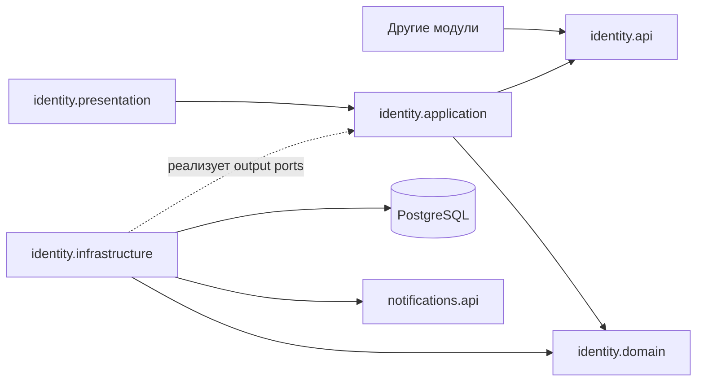
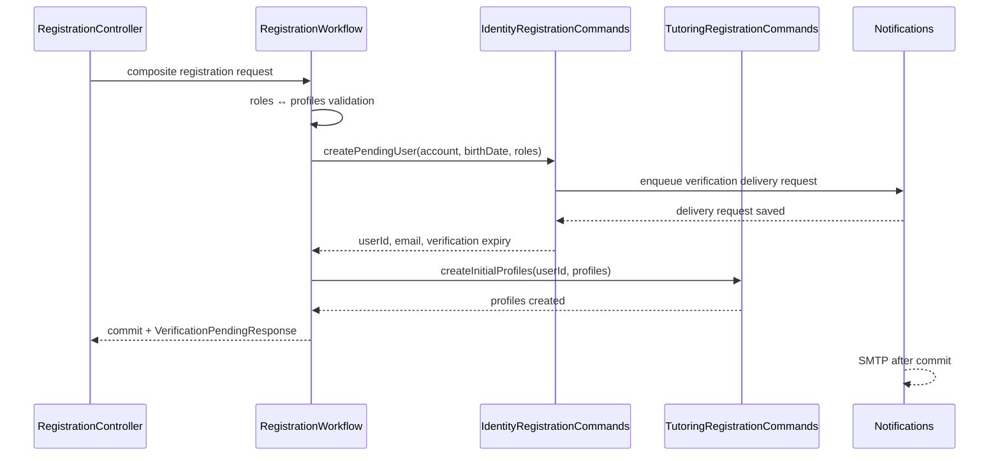

# Identity: полная архитектура модуля

## 1. Статус и назначение

Этот документ — актуальная исполняемая спецификация модуля `identity` для агента-разработчика. Редакция учитывает решение от 2026-09-13:

- дата рождения принадлежит Identity;
- регистрация обязательно создаёт минимум один учебный профиль;
- Identity хранит роли, но не знает о профилях;
- регистрацию координирует `RegistrationWorkflow`;
- Identity и Tutoring участвуют в одной PostgreSQL-транзакции;
- изменение второй роли координирует `RoleOnboardingWorkflow`;
- у профилей Tutoring есть собственные имя и email;
- Identity публикует отдельное событие подтверждения account email.

Package paths приведены относительно корневого Java package проекта.

## 2. Источники истины

Для внутреннего устройства Identity этот документ имеет приоритет над ранее экспортированными UML-каталогами. HTTP-контракты находятся в `docs/api`; регистрационный и профильный контракты должны быть синхронизированы с решениями этой редакции до реализации соответствующих endpoint.

Канонические термины:

| Использовать | Не использовать |
|---|---|
| `TEACHER` | `TUTOR` |
| `STUDENT` | дополнительные роли без отдельного решения |
| `PENDING_EMAIL_VERIFICATION` | `PENDING_VERIFICATION` |
| `/api/v1/me` | `/api/v1/users/me` |
| account email | profile contact email как синоним account email |

`firstName` и `lastName` образуют имя аккаунта. `displayName` каждого учебного профиля является отдельным значением Tutoring.

## 3. Ответственность и границы

Identity владеет:

- `User` и его идентификатором;
- `firstName`, `lastName` и `birthDate` аккаунта;
- текущим и ожидающим подтверждения account email;
- password hash;
- ролями `TEACHER` и `STUDENT`;
- статусом аккаунта;
- подтверждением account email;
- access JWT и состоянием refresh tokens;
- публичными безопасными представлениями пользователя;
- событиями аккаунта.

Identity не владеет:

- `TeacherProfile`, `StudentProfile` и их `displayName`;
- `contactEmail`, `pendingContactEmail` и подтверждением profile email;
- предметами, приглашениями и связями преподаватель–ученик;
- уроками, расписанием и статистикой;
- SMTP, почтовыми шаблонами и retry доставки;
- межмодульным инвариантом «роль имеет профиль».

Межмодульный инвариант принадлежит Workflows:

```text
TEACHER входит в User.roles ⇔ TeacherProfile создан
STUDENT входит в User.roles ⇔ StudentProfile создан
```

Identity проверяет только наличие минимум одной допустимой роли. Tutoring проверяет только профильные данные и уникальность профиля по `userId`. Их согласованность обеспечивает Workflow.

## 4. Слои и зависимости

```text
identity
├── api
├── presentation
├── application
├── domain
└── infrastructure
```



Разрешено:

```text
identity.presentation   → identity.application.port.in
identity.presentation   → identity.application.command/query/result
identity.application    → identity.domain
identity.application    → identity.api
identity.infrastructure → identity.application.port.out
identity.infrastructure → identity.application.model
identity.infrastructure → identity.domain
workflows                → identity.api.command/query
tutoring                 → identity.api.query/event
```

Запрещено:

```text
identity.domain         -X-> Spring / jOOQ / application / infrastructure
identity.application    -X-> presentation / infrastructure
identity.presentation   -X-> domain / infrastructure / repositories
identity.api            -X-> internal Identity packages
other modules           -X-> Identity tables or internal packages
identity                -X-> Tutoring internal packages
identity                -X-> Notifications internal packages
```

Командные контракты Identity вызываются только Workflows. Это ограничение закрепляется ArchUnit.

## 5. Полная структура пакетов

```text
identity
├── api
│   ├── query
│   │   ├── IdentityQuery
│   │   ├── IdentityPersonalDataQuery
│   │   └── PersonalDataPurpose
│   ├── command
│   │   ├── registration
│   │   │   ├── IdentityRegistrationCommands
│   │   │   ├── CreatePendingUserCommand
│   │   │   └── PendingUserResult
│   │   └── role
│   │       ├── IdentityRoleCommands
│   │       └── AddUserRoleCommand
│   ├── model
│   │   ├── UserSummary
│   │   ├── UserRoleView
│   │   ├── UserStatusView
│   │   └── AccountEmailVerificationPurpose
│   └── event
│       ├── UserRegisteredEvent
│       ├── UserActivatedEvent
│       ├── UserAccountUpdatedEvent
│       └── AccountEmailVerifiedEvent
├── presentation
│   ├── auth
│   │   ├── controller
│   │   │   ├── AuthController
│   │   │   └── EmailVerificationController
│   │   ├── model
│   │   │   ├── request
│   │   │   │   ├── LoginRequest
│   │   │   │   ├── ConfirmEmailRequest
│   │   │   │   └── ResendEmailVerificationRequest
│   │   │   └── response
│   │   │       ├── TokenResponse
│   │   │       └── VerificationPendingResponse
│   │   ├── mapper
│   │   │   └── AuthPresentationMapper
│   │   └── cookie
│   │       └── RefreshTokenCookieFactory
│   ├── account
│   │   ├── controller
│   │   │   └── CurrentUserController
│   │   ├── model
│   │   │   ├── request
│   │   │   │   └── UpdateCurrentUserRequest
│   │   │   └── response
│   │   │       └── UserResponse
│   │   ├── mapper
│   │   │   └── UserPresentationMapper
│   │   └── validation
│   │       ├── ValidAccountUpdate
│   │       └── AccountUpdateValidator
│   └── error
│       ├── handler
│       │   ├── IdentityExceptionHandler
│       │   ├── RestAuthenticationEntryPoint
│       │   └── RestAccessDeniedHandler
│       └── model
│           ├── ApiError
│           ├── FieldErrorResponse
│           └── ErrorCode
├── application
│   ├── port
│   │   ├── in
│   │   │   ├── account
│   │   │   │   ├── GetCurrentUserUseCase
│   │   │   │   └── UpdateCurrentUserUseCase
│   │   │   ├── verification
│   │   │   │   ├── ConfirmEmailUseCase
│   │   │   │   └── ResendEmailVerificationUseCase
│   │   │   └── authentication
│   │   │       ├── LoginUseCase
│   │   │       ├── RefreshTokenUseCase
│   │   │       └── LogoutUseCase
│   │   ├── out
│   │   │   ├── persistence
│   │   │   │   ├── UserRepository
│   │   │   │   ├── EmailVerificationRepository
│   │   │   │   └── RefreshTokenRepository
│   │   │   ├── security
│   │   │   │   ├── PasswordHasher
│   │   │   │   ├── AccessTokenIssuer
│   │   │   │   ├── RefreshTokenIssuer
│   │   │   │   ├── RefreshTokenHasher
│   │   │   │   ├── VerificationTokenGenerator
│   │   │   │   └── VerificationTokenHasher
│   │   │   └── messaging
│   │   │       ├── VerificationEmailSender
│   │   │       └── IntegrationEventPublisher
│   │   └── TimeProvider
│   ├── command
│   │   ├── account
│   │   │   └── UpdateCurrentUserCommand
│   │   ├── verification
│   │   │   ├── ConfirmEmailCommand
│   │   │   └── ResendEmailVerificationCommand
│   │   └── authentication
│   │       ├── LoginCommand
│   │       ├── RefreshTokenCommand
│   │       └── LogoutCommand
│   ├── query
│   │   └── GetCurrentUserQuery
│   ├── result
│   │   ├── ResendVerificationResult
│   │   ├── AuthenticationResult
│   │   └── CurrentUserResult
│   ├── model
│   │   ├── IssuedAccessToken
│   │   ├── IssuedRefreshToken
│   │   └── RefreshTokenState
│   ├── service
│   │   ├── account
│   │   │   ├── RegisterUserService
│   │   │   ├── AddUserRoleService
│   │   │   ├── GetCurrentUserService
│   │   │   ├── UpdateCurrentUserService
│   │   │   ├── IdentityQueryService
│   │   │   └── IdentityPersonalDataQueryService
│   │   ├── verification
│   │   │   ├── ConfirmEmailService
│   │   │   └── ResendEmailVerificationService
│   │   └── authentication
│   │       ├── LoginService
│   │       ├── RefreshTokenService
│   │       └── LogoutService
│   ├── mapper
│   │   ├── UserResultMapper
│   │   └── IdentityApiMapper
│   └── exception
│       ├── InvalidUseCaseInputException
│       ├── UserNotFoundException
│       ├── EmailAlreadyExistsException
│       ├── RoleAlreadyAssignedException
│       ├── InvalidCredentialsException
│       ├── EmailVerificationRequiredException
│       ├── InvalidVerificationTokenException
│       ├── InvalidRefreshTokenException
│       └── AccountOperationNotAllowedException
├── domain
│   ├── user
│   │   ├── model
│   │   │   ├── User
│   │   │   ├── Email
│   │   │   ├── PasswordHash
│   │   │   ├── UserRole
│   │   │   └── UserStatus
│   │   ├── event
│   │   │   ├── UserRegisteredDomainEvent
│   │   │   ├── UserActivatedDomainEvent
│   │   │   └── UserAccountUpdatedDomainEvent
│   │   └── exception
│   │       ├── InvalidEmailException
│   │       ├── InvalidUserDataException
│   │       ├── InvalidUserStateException
│   │       └── EmailNotVerifiedException
│   └── verification
│       ├── EmailVerification
│       ├── VerificationTokenHash
│       ├── VerificationPurpose
│       └── InvalidEmailVerificationException
└── infrastructure
    ├── persistence
    │   ├── adapter
    │   │   ├── JooqUserRepositoryAdapter
    │   │   ├── JooqEmailVerificationRepositoryAdapter
    │   │   └── JooqRefreshTokenRepositoryAdapter
    │   ├── mapper
    │   │   ├── UserPersistenceMapper
    │   │   ├── EmailVerificationPersistenceMapper
    │   │   └── RefreshTokenPersistenceMapper
    │   └── data
    │       ├── model
    │       │   └── UserPersistenceData
    │       ├── repository
    │       │   ├── UserJooqRepository
    │       │   ├── EmailVerificationJooqRepository
    │       │   └── RefreshTokenJooqRepository
    │       └── generated
    ├── security
    │   ├── password
    │   │   └── BCryptPasswordHasher
    │   ├── token
    │   │   ├── SpringJwtAccessTokenIssuer
    │   │   ├── SecureRefreshTokenIssuer
    │   │   ├── Sha256RefreshTokenHasher
    │   │   ├── SecureVerificationTokenGenerator
    │   │   └── Sha256VerificationTokenHasher
    │   ├── authentication
    │   │   └── IdentityJwtAuthenticationConverter
    │   └── configuration
    │       ├── SecurityConfiguration
    │       ├── JwtConfiguration
    │       └── IdentityTokenProperties
    ├── messaging
    │   ├── email
    │   │   ├── NotificationVerificationEmailAdapter
    │   │   └── IdentityNotificationProperties
    │   └── event
    │       └── SpringIntegrationEventPublisher
    └── time
        └── SystemTimeProvider
```

`RegisterRequest` и `RegistrationController` больше не принадлежат Identity. Они находятся в `workflows.registration.presentation`, поскольку регистрация изменяет Identity и Tutoring.

## 6. Публичный API Identity

### 6.1 Read API

```java
package identity.api.query;

public interface IdentityQuery {
    Optional<UserSummary> findUserById(UUID userId);
    Map<UUID, UserSummary> findUsersByIds(Set<UUID> userIds);
    Optional<UserSummary> findUserByVerifiedEmail(String normalizedEmail);
}
```

`findUsersByIds` предотвращает N+1 при составных списках. `findUserByVerifiedEmail` используется для приглашений и возвращает только аккаунт с подтверждённым текущим email.

Дата рождения не входит в общий `UserSummary`. Доступ к ней имеет только доверенная query facade после проверки бизнес-основания:

```java
package identity.api.query;

public interface IdentityPersonalDataQuery {
    Optional<LocalDate> findBirthDate(
        UUID userId,
        UUID requesterId,
        PersonalDataPurpose purpose
    );
}

public enum PersonalDataPurpose {
    STUDENT_CARD
}
```

ArchUnit разрешает использовать `IdentityPersonalDataQuery` только пакетам `workflows..` и утверждённым query facades. Facade проверяет связь пользователя и настройку видимости через модуль-владелец. Identity проверяет полноту контекста запроса, возвращает данные только для разрешённого `purpose` и может записать факт доступа в аудит.

```java
public record UserSummary(
    UUID id,
    String email,
    String firstName,
    String lastName,
    Set<UserRoleView> roles,
    UserStatusView status
) {}

public enum UserRoleView {
    TEACHER,
    STUDENT
}

public enum UserStatusView {
    PENDING_EMAIL_VERIFICATION,
    ACTIVE,
    SUSPENDED,
    DEACTIVATED
}
```

### 6.2 Registration command API

Это внутренний Java API для `RegistrationWorkflow`, а не REST endpoint.

```java
package identity.api.command.registration;

public interface IdentityRegistrationCommands {
    PendingUserResult createPendingUser(CreatePendingUserCommand command);
}

public record CreatePendingUserCommand(
    UUID operationId,
    String email,
    String rawPassword,
    String firstName,
    String lastName,
    LocalDate birthDate,
    Set<UserRoleView> roles
) {}

public record PendingUserResult(
    UUID userId,
    String email,
    Instant verificationExpiresAt
) {}
```

`operationId` обеспечивает идемпотентность повторного вызова Workflow. Raw password не сохраняется, не логируется и передаётся только в Identity.

### 6.3 Role command API

```java
package identity.api.command.role;

public interface IdentityRoleCommands {
    void addRole(AddUserRoleCommand command);
}

public record AddUserRoleCommand(
    UUID operationId,
    UUID userId,
    UserRoleView role
) {}
```

Контракт вызывает только `RoleOnboardingWorkflow`. Identity проверяет существование, активность и отсутствие роли. Tutoring profile создаётся другим шагом той же общей транзакции.

### 6.4 Integration events

```text
UserRegisteredEvent
    eventId: UUID
    userId: UUID
    email: String
    occurredAt: Instant

UserActivatedEvent
    eventId: UUID
    userId: UUID
    email: String
    occurredAt: Instant

UserAccountUpdatedEvent
    eventId: UUID
    userId: UUID
    changedFields: Set<String>
    occurredAt: Instant

AccountEmailVerifiedEvent
    eventId: UUID
    userId: UUID
    email: String
    purpose: AccountEmailVerificationPurpose
    occurredAt: Instant
```

```java
public enum AccountEmailVerificationPurpose {
    REGISTRATION,
    EMAIL_CHANGE
}
```

`AccountEmailVerifiedEvent` публикуется после каждого успешного подтверждения account email. Он не содержит raw token. Tutoring обрабатывает его идемпотентно для привязки приглашений и подтверждения совпадающих profile emails.

`UserActivatedEvent` сообщает об изменении жизненного цикла аккаунта. `AccountEmailVerifiedEvent` сообщает о подтверждении владения конкретным адресом. Эти события не являются дубликатами.

## 7. Presentation Identity

Identity Presentation отвечает за login, refresh, logout, подтверждение account email, текущий аккаунт, cookies и ошибки.

`POST /api/v1/auth/register` обслуживает `workflows.registration.presentation.RegistrationController`, а не Identity.

### 7.1 Endpoint mapping

| Метод и путь | Input port | Ответ |
|---|---|---|
| `POST /api/v1/auth/email-verification/confirm` | `ConfirmEmailUseCase` | `200 TokenResponse` + refresh cookie |
| `POST /api/v1/auth/email-verification/resend` | `ResendEmailVerificationUseCase` | `202 VerificationPendingResponse` |
| `POST /api/v1/auth/login` | `LoginUseCase` | `200 TokenResponse` + refresh cookie |
| `POST /api/v1/auth/refresh` | `RefreshTokenUseCase` | `200 TokenResponse` + rotated cookie |
| `POST /api/v1/auth/logout` | `LogoutUseCase` | `204` + cleared cookie |
| `GET /api/v1/me` | составной `MeQueryFacade` | `200 MeResponse` |
| `PATCH /api/v1/me` | `UpdateCurrentUserUseCase` | `200 UserResponse` |

Identity может реализовать внутреннюю часть чтения текущего User, но составной `GET /me` находится во внешней query facade, потому что возвращает также профили Tutoring.

### 7.2 DTO Identity

```text
LoginRequest
    email: String
    password: String

ConfirmEmailRequest
    token: String

ResendEmailVerificationRequest
    email: String

UpdateCurrentUserRequest
    email: String?
    firstName: String?
    lastName: String?
    birthDate: LocalDate?

TokenResponse
    accessToken: String
    tokenType: String = "Bearer"
    expiresInSeconds: long

VerificationPendingResponse
    email: String
    verificationExpiresAt: Instant

UserResponse
    id: UUID
    email: String
    pendingEmail: String?
    firstName: String
    lastName: String
    birthDate: LocalDate
    roles: Set<UserRoleView>
    status: UserStatusView
    emailVerifiedAt: Instant?
    createdAt: Instant
    updatedAt: Instant
```

Обновление `birthDate` через PATCH допускается только после отдельной продуктовой проверки. Если такой операции нет в утверждённом HTTP-контракте, поле остаётся read-only и отсутствует в `UpdateCurrentUserRequest`.

### 7.3 Классы Presentation

| Класс | Ответственность |
|---|---|
| `AuthController` | Login, refresh и logout; register здесь отсутствует |
| `EmailVerificationController` | Confirm и resend account email |
| `CurrentUserController` | Identity-часть чтения и изменение текущего аккаунта |
| `AuthPresentationMapper` | Auth request → command; result → response |
| `UserPresentationMapper` | Account request/query/result mapping |
| `RefreshTokenCookieFactory` | Создание и очистка `REFRESH_TOKEN` cookie |
| `ValidAccountUpdate` | Class-level transport constraint |
| `AccountUpdateValidator` | Проверка структуры PATCH без domain/repository calls |

Контроллер получает `userId` из подтверждённого `Authentication`, а не из request body.

### 7.4 Ошибки

```text
ApiError
    code: ErrorCode
    message: String
    fieldErrors: List<FieldErrorResponse>
    requestId: String
```

`IdentityExceptionHandler`, `RestAuthenticationEntryPoint` и `RestAccessDeniedHandler` создают один формат. Минимальные коды Identity:

```text
VALIDATION_ERROR
UNAUTHENTICATED
INVALID_CREDENTIALS
EMAIL_NOT_VERIFIED
INVALID_REFRESH_TOKEN
FORBIDDEN
NOT_FOUND
EMAIL_ALREADY_EXISTS
ROLE_ALREADY_ASSIGNED
INVALID_VERIFICATION_TOKEN
RATE_LIMIT_EXCEEDED
INTERNAL_ERROR
```

## 8. Application Identity

Application содержит use cases, orchestration внутри Identity и транзакционные границы. Неизменяемые command/query/result/model реализуются Java records.

### 8.1 Input ports

```java
public interface GetCurrentUserUseCase {
    CurrentUserResult getCurrentUser(GetCurrentUserQuery query);
}

public interface UpdateCurrentUserUseCase {
    CurrentUserResult updateCurrentUser(UpdateCurrentUserCommand command);
}

public interface ConfirmEmailUseCase {
    AuthenticationResult confirmEmail(ConfirmEmailCommand command);
}

public interface ResendEmailVerificationUseCase {
    ResendVerificationResult resendEmailVerification(
        ResendEmailVerificationCommand command
    );
}

public interface LoginUseCase {
    AuthenticationResult login(LoginCommand command);
}

public interface RefreshTokenUseCase {
    AuthenticationResult refresh(RefreshTokenCommand command);
}

public interface LogoutUseCase {
    void logout(LogoutCommand command);
}
```

Registration и role onboarding используют public command API из `identity.api.command` как входные порты. Дублирующий `RegisterUserUseCase` не создаётся.

### 8.2 Commands, query, results и models

```text
UpdateCurrentUserCommand
    userId: UUID
    email: String?
    firstName: String?
    lastName: String?
    birthDate: LocalDate?  // только если изменение разрешено контрактом

ConfirmEmailCommand
    rawToken: String

ResendEmailVerificationCommand
    email: String

LoginCommand
    email: String
    rawPassword: String

RefreshTokenCommand
    rawRefreshToken: String

LogoutCommand
    rawRefreshToken: String

GetCurrentUserQuery
    userId: UUID

ResendVerificationResult
    email: String
    verificationExpiresAt: Instant

AuthenticationResult
    accessToken: IssuedAccessToken
    refreshToken: IssuedRefreshToken
    user: CurrentUserResult

CurrentUserResult
    id: UUID
    email: String
    pendingEmail: String?
    firstName: String
    lastName: String
    birthDate: LocalDate
    roles: Set<UserRole>
    status: UserStatus
    emailVerifiedAt: Instant?
    createdAt: Instant
    updatedAt: Instant

IssuedAccessToken
    value: String
    expiresAt: Instant

IssuedRefreshToken
    value: String
    expiresAt: Instant

RefreshTokenState
    id: UUID
    userId: UUID
    tokenHash: String
    familyId: UUID
    expiresAt: Instant
    revokedAt: Instant?
    createdAt: Instant
```

### 8.3 Output ports

```java
public interface UserRepository {
    Optional<User> findById(UUID userId);
    Optional<User> findByEmail(Email email);
    Map<UUID, User> findByIds(Set<UUID> userIds);
    boolean existsByEmail(Email email);
    User save(User user);
}

public interface EmailVerificationRepository {
    Optional<EmailVerification> findActiveByTokenHash(
        VerificationTokenHash tokenHash,
        Instant now
    );

    EmailVerification save(EmailVerification verification);

    void invalidateActiveForUser(
        UUID userId,
        VerificationPurpose purpose,
        Instant invalidatedAt
    );
}

public interface RefreshTokenRepository {
    Optional<RefreshTokenState> findActiveByTokenHash(
        String tokenHash,
        Instant now
    );

    RefreshTokenState save(RefreshTokenState token);
    void revoke(UUID tokenId, Instant revokedAt);
    void revokeFamily(UUID familyId, Instant revokedAt);
}

public interface PasswordHasher {
    PasswordHash hash(String rawPassword);
    boolean matches(String rawPassword, PasswordHash passwordHash);
}

public interface AccessTokenIssuer {
    IssuedAccessToken issue(User user);
}

public interface RefreshTokenIssuer {
    IssuedRefreshToken issue();
}

public interface RefreshTokenHasher {
    String hash(String rawToken);
}

public interface VerificationTokenGenerator {
    String generate();
}

public interface VerificationTokenHasher {
    VerificationTokenHash hash(String rawToken);
}

public interface VerificationEmailSender {
    void sendVerificationEmail(
        Email recipient,
        String rawToken,
        VerificationPurpose purpose,
        Instant expiresAt
    );
}

public interface IntegrationEventPublisher {
    void publish(Object integrationEvent);
}

public interface TimeProvider {
    Instant now();
}
```

### 8.4 Services

| Сервис | Реализует | Ответственность |
|---|---|---|
| `RegisterUserService` | `IdentityRegistrationCommands` | Идемпотентно создаёт pending User, роли и account-email verification; не знает о профилях |
| `AddUserRoleService` | `IdentityRoleCommands` | Добавляет вторую отсутствующую роль активному User; не создаёт профиль |
| `GetCurrentUserService` | `GetCurrentUserUseCase` | Загружает User и формирует result |
| `UpdateCurrentUserService` | `UpdateCurrentUserUseCase` | Изменяет account data; при смене email создаёт verification |
| `IdentityQueryService` | `IdentityQuery` | Публичное одиночное, пакетное и email-чтение |
| `IdentityPersonalDataQueryService` | `IdentityPersonalDataQuery` | Узкое чтение birthDate для разрешённых facades |
| `ConfirmEmailService` | `ConfirmEmailUseCase` | Подтверждает account email, consume verification, выпускает tokens, публикует events |
| `ResendEmailVerificationService` | `ResendEmailVerificationUseCase` | Инвалидирует старую verification, создаёт новую и ставит письмо в очередь |
| `LoginService` | `LoginUseCase` | Проверяет пароль/status и выпускает пару tokens |
| `RefreshTokenService` | `RefreshTokenUseCase` | Атомарно ротирует refresh token family и выпускает access JWT |
| `LogoutService` | `LogoutUseCase` | Идемпотентно отзывает refresh token |

`RegisterUserService` и `AddUserRoleService` присоединяются к внешней транзакции Workflow. Для production рекомендуется `Propagation.MANDATORY`. Остальные mutating use cases используют транзакционную границу своего application service.

Application services не вызывают друг друга. Общая логика находится в domain, mapper или output port.

### 8.5 Mappers и exceptions

```text
UserResultMapper
    User → CurrentUserResult

IdentityApiMapper
    User → UserSummary
    domain/result → public integration events
```

```text
InvalidUseCaseInputException
UserNotFoundException
EmailAlreadyExistsException
RoleAlreadyAssignedException
InvalidCredentialsException
EmailVerificationRequiredException
InvalidVerificationTokenException
InvalidRefreshTokenException
AccountOperationNotAllowedException
```

## 9. Domain Identity

Domain — чистый Java без Spring, jOOQ, Jackson и persistence annotations.

### 9.1 Aggregate root `User`

```text
User
    id: UUID
    email: Email
    pendingEmail: Email?
    passwordHash: PasswordHash
    firstName: String
    lastName: String
    birthDate: LocalDate
    roles: Set<UserRole>
    status: UserStatus
    emailVerifiedAt: Instant?
    createdAt: Instant
    updatedAt: Instant
    domainEvents: List<DomainEvent>
```

Операции:

```text
register(...): User
verifyRegistrationEmail(Email target, Instant now): void
requestEmailChange(Email newEmail, Instant now): void
confirmPendingEmail(Email target, Instant now): void
updateAccountName(String firstName, String lastName, Instant now): void
changeBirthDate(LocalDate birthDate, Instant now): void
changePassword(PasswordHash passwordHash, Instant now): void
addRole(UserRole role, Instant now): void
suspend(Instant now): void
deactivate(Instant now): void
pullDomainEvents(): List<DomainEvent>
```

Инварианты:

- email, password hash, first name, last name и birth date обязательны;
- birth date не находится в будущем;
- минимум одна роль обязательна;
- допустимые роли v1: `TEACHER`, `STUDENT`;
- новый User имеет статус `PENDING_EMAIL_VERIFICATION`;
- активация выполняется подтверждением registration email;
- pending email не заменяет current email до подтверждения;
- current и pending email не совпадают;
- suspended/deactivated User не может login/refresh;
- повторное добавление роли не изменяет агрегат и переводится application-слоем в идемпотентный результат либо `RoleAlreadyAssignedException` согласно контракту Workflow;
- изменения обновляют `updatedAt` и создают необходимые domain events;
- collections наружу возвращаются неизменяемыми.

```text
Email(value: String)
PasswordHash(value: String)

UserRole
    TEACHER
    STUDENT

UserStatus
    PENDING_EMAIL_VERIFICATION
    ACTIVE
    SUSPENDED
    DEACTIVATED
```

Domain events:

```text
UserRegisteredDomainEvent(userId, email, occurredAt)
UserActivatedDomainEvent(userId, email, occurredAt)
UserAccountUpdatedDomainEvent(userId, changedFields, occurredAt)
```

Domain exceptions:

```text
InvalidEmailException
InvalidUserDataException
InvalidUserStateException
EmailNotVerifiedException
```

### 9.2 Aggregate root `EmailVerification`

```text
EmailVerification
    id: UUID
    userId: UUID
    targetEmail: Email
    tokenHash: VerificationTokenHash
    purpose: VerificationPurpose
    expiresAt: Instant
    consumedAt: Instant?
    invalidatedAt: Instant?
    createdAt: Instant
```

Операции:

```text
create(...): EmailVerification
isActiveAt(Instant now): boolean
consume(Instant now): void
invalidate(Instant now): void
```

Инварианты:

- verification относится к одному userId, email и purpose;
- raw token не хранится в агрегате;
- `expiresAt` позже `createdAt`;
- consumed, invalidated или expired verification нельзя использовать;
- `REGISTRATION` подтверждает current email и активирует User;
- `EMAIL_CHANGE` подтверждает pending email и заменяет current email.

```text
VerificationTokenHash(value: String)

VerificationPurpose
    REGISTRATION
    EMAIL_CHANGE

InvalidEmailVerificationException
```

`EmailVerification` хранит `UUID userId`, а не объект User. Совместное изменение агрегатов координирует application service.

## 10. Infrastructure Identity

### 10.1 Persistence

| Реализация | Порт | Внутренние зависимости |
|---|---|---|
| `JooqUserRepositoryAdapter` | `UserRepository` | `UserJooqRepository`, `UserPersistenceMapper` |
| `JooqEmailVerificationRepositoryAdapter` | `EmailVerificationRepository` | `EmailVerificationJooqRepository`, mapper |
| `JooqRefreshTokenRepositoryAdapter` | `RefreshTokenRepository` | `RefreshTokenJooqRepository`, mapper |

```text
UserPersistenceData
    UsersRecord user
    List<UserEmailsRecord> emails
    List<UserRolesRecord> roles
```

Низкоуровневые `*.data.repository` используют только `DSLContext`, generated records и internal data carriers. Они не импортируют domain. jOOQ types не выходят из persistence.

`UserPersistenceMapper` восстанавливает также `birthDate`. Reconstitution factory не создаёт domain events.

### 10.2 Security

| Реализация | Порт/контракт | Поведение |
|---|---|---|
| `BCryptPasswordHasher` | `PasswordHasher` | BCrypt hash/matches |
| `SpringJwtAccessTokenIssuer` | `AccessTokenIssuer` | RS256; `sub`, `roles`, `iss`, `aud`, `iat`, `exp` |
| `SecureRefreshTokenIssuer` | `RefreshTokenIssuer` | `SecureRandom`, URL-safe opaque token |
| `Sha256RefreshTokenHasher` | `RefreshTokenHasher` | SHA-256 до поиска/хранения |
| `SecureVerificationTokenGenerator` | `VerificationTokenGenerator` | `SecureRandom`, URL-safe one-time token |
| `Sha256VerificationTokenHasher` | `VerificationTokenHasher` | SHA-256 до поиска/хранения |
| `IdentityJwtAuthenticationConverter` | Spring Converter | `sub` → UUID principal, roles → authorities |

`SecurityConfiguration` создаёт stateless chain, подключает Resource Server JWT, CORS, Origin/CSRF-политику cookie endpoints и единые error handlers.

JWT проверяется локально без SQL на каждый запрос. После добавления второй роли клиент выполняет refresh, чтобы получить JWT с актуальными claims.

### 10.3 Messaging и Time

`NotificationVerificationEmailAdapter` реализует `VerificationEmailSender` и вызывает только `notifications.api.NotificationGateway`. Notifications сохраняет delivery request в общей транзакции, а SMTP выполняет после commit.

`SpringIntegrationEventPublisher` публикует public events через `ApplicationEventPublisher`. Подписчики используют after-commit handling.

`SystemTimeProvider` использует внедрённый `Clock`; tests передают fixed clock.

## 11. PostgreSQL

```text
identity_users
identity_user_emails
identity_user_roles
identity_email_verifications
identity_refresh_tokens
```

### `identity_users`

```text
id                  uuid primary key
password_hash       varchar not null
first_name          varchar not null
last_name           varchar not null
birth_date          date not null
status              varchar not null
email_verified_at   timestamptz null
created_at          timestamptz not null
updated_at          timestamptz not null

CHECK birth_date <= CURRENT_DATE
CHECK status IN (
    'PENDING_EMAIL_VERIFICATION',
    'ACTIVE',
    'SUSPENDED',
    'DEACTIVATED'
)
```

Проверку будущей даты выполняет domain и application. Database CHECK требует учёта того, что PostgreSQL запрещает volatile expressions в некоторых видах ограничений; если `CURRENT_DATE` недопустим для выбранной миграционной политики, оставь DB type/not-null и проверяй дату в domain.

### `identity_user_emails`

```text
user_id     uuid not null references identity_users(id) on delete cascade
email       varchar not null
kind        varchar not null

PRIMARY KEY (user_id, kind)
UNIQUE (email)
CHECK kind IN ('CURRENT', 'PENDING')
CHECK email = lower(email)
```

`UNIQUE(email)` резервирует CURRENT и PENDING адреса и защищает от race condition.

### `identity_user_roles`

```text
user_id     uuid not null references identity_users(id) on delete cascade
role        varchar not null

PRIMARY KEY (user_id, role)
CHECK role IN ('TEACHER', 'STUDENT')
```

### `identity_email_verifications`

```text
id               uuid primary key
user_id          uuid not null references identity_users(id) on delete cascade
target_email     varchar not null
token_hash       varchar(64) not null unique
purpose          varchar not null
expires_at       timestamptz not null
consumed_at      timestamptz null
invalidated_at   timestamptz null
created_at       timestamptz not null

CHECK purpose IN ('REGISTRATION', 'EMAIL_CHANGE')
CHECK expires_at > created_at
INDEX (user_id, purpose)
INDEX (expires_at)
```

### `identity_refresh_tokens`

```text
id            uuid primary key
user_id       uuid not null references identity_users(id) on delete cascade
token_hash    varchar(64) not null unique
family_id     uuid not null
expires_at    timestamptz not null
revoked_at    timestamptz null
created_at    timestamptz not null

CHECK expires_at > created_at
INDEX (user_id)
INDEX (family_id)
INDEX (expires_at)
```

Все timestamp отображаются Java `Instant`; birth date — `LocalDate`/PostgreSQL `date`.

## 12. RegistrationWorkflow и общая транзакция

Регистрация является workflow, поскольку изменяет два модуля.



Требования:

- `RegistrationController` находится в Workflows;
- `RegistrationWorkflow` имеет outer `@Transactional`;
- Identity и Tutoring используют тот же `PlatformTransactionManager` и datasource;
- command services присоединяются к транзакции (`MANDATORY` или проверенный `REQUIRED`);
- Workflow проверяет минимум один профиль и точное соответствие ролям;
- Identity не импортирует Tutoring;
- Tutoring не импортирует внутренние пакеты Identity;
- ошибка любого шага откатывает User, verification, роли, profiles и delivery request;
- SMTP и внешние эффекты запускаются только после commit;
- повторный `operationId` безопасно возвращает прежний результат.

### RoleOnboardingWorkflow

```text
validate requested profile
→ IdentityRoleCommands.addRole(operationId, userId, role)
→ TutoringRegistrationCommands.createProfile(operationId, userId, profile)
→ commit
→ frontend refreshes access JWT
```

Удаление роли в v1 не поддерживается.

## 13. Account email confirmation event

После consume verification `ConfirmEmailService` публикует:

```text
AccountEmailVerifiedEvent(
    eventId,
    userId,
    normalizedEmail,
    REGISTRATION | EMAIL_CHANGE,
    occurredAt
)
```

Для регистрации дополнительно публикуется `UserActivatedEvent`. Для смены email — `UserAccountUpdatedEvent`.

Tutoring handler:

```text
AccountEmailVerifiedEvent
→ найти PENDING invitations по normalized email
→ связать их с userId без принятия
→ найти profiles пользователя
→ если contactEmail совпадает, отметить его подтверждённым
```

Обработчик идемпотентен по `eventId` и database constraints.

## 14. Транзакционные границы Identity

| Use case | Транзакция |
|---|---|
| Registration | Outer transaction Workflows: User + roles + verification + profiles |
| Add second role | Outer transaction Workflows: role + profile |
| Confirm registration email | Verification consume + User activation + refresh hash |
| Request account email change | PENDING email + User + verification |
| Confirm changed account email | Verification consume + PENDING → CURRENT |
| Login | Refresh hash creation |
| Refresh | Revoke current + create next token in family |
| Logout | Revoke matching refresh token |

Concurrency rules:

- email uniqueness окончательно обеспечивает `UNIQUE(email)`;
- unique violation преобразуется в `EmailAlreadyExistsException`;
- verification consume использует lock или conditional update;
- refresh rotation использует row lock/conditional update;
- reuse отозванного refresh token отзывает family;
- logout идемпотентен;
- resend не раскрывает существование аккаунта.

## 15. JWT и cookie

```text
Algorithm: RS256
Claims: sub, roles, iss, aud, iat, exp
Access token: short-lived, response JSON
Refresh token: opaque random value, HttpOnly cookie
Stored refresh value: SHA-256 hash only
```

```text
Cookie name = REFRESH_TOKEN
HttpOnly = true
Secure = true in production
SameSite = Lax
Path = /api/v1/auth
Max-Age = refresh token lifetime
```

Private keys, passwords, JWT и raw tokens не логируются.

## 16. Матрица реализаций

| Порт | Production implementation |
|---|---|
| `IdentityRegistrationCommands` | `RegisterUserService` |
| `IdentityRoleCommands` | `AddUserRoleService` |
| `IdentityQuery` | `IdentityQueryService` |
| `IdentityPersonalDataQuery` | `IdentityPersonalDataQueryService` |
| `GetCurrentUserUseCase` | `GetCurrentUserService` |
| `UpdateCurrentUserUseCase` | `UpdateCurrentUserService` |
| `ConfirmEmailUseCase` | `ConfirmEmailService` |
| `ResendEmailVerificationUseCase` | `ResendEmailVerificationService` |
| `LoginUseCase` | `LoginService` |
| `RefreshTokenUseCase` | `RefreshTokenService` |
| `LogoutUseCase` | `LogoutService` |
| `UserRepository` | `JooqUserRepositoryAdapter` |
| `EmailVerificationRepository` | `JooqEmailVerificationRepositoryAdapter` |
| `RefreshTokenRepository` | `JooqRefreshTokenRepositoryAdapter` |
| `PasswordHasher` | `BCryptPasswordHasher` |
| `AccessTokenIssuer` | `SpringJwtAccessTokenIssuer` |
| `RefreshTokenIssuer` | `SecureRefreshTokenIssuer` |
| `RefreshTokenHasher` | `Sha256RefreshTokenHasher` |
| `VerificationTokenGenerator` | `SecureVerificationTokenGenerator` |
| `VerificationTokenHasher` | `Sha256VerificationTokenHasher` |
| `VerificationEmailSender` | `NotificationVerificationEmailAdapter` |
| `IntegrationEventPublisher` | `SpringIntegrationEventPublisher` |
| `TimeProvider` | `SystemTimeProvider` |

## 17. Архитектурные тесты

```text
identity.api не зависит от внутренних пакетов Identity
identity.domain зависит только от JDK
identity.application не зависит от presentation/infrastructure
identity.presentation не зависит от domain/infrastructure
identity.infrastructure.persistence.data.repository не зависит от domain
service.account не зависит от service.verification/authentication
service.verification не зависит от service.account/authentication
service.authentication не зависит от service.account/verification
только workflows вызывает identity.api.command
только разрешённые facades вызывают IdentityPersonalDataQuery
другие модули используют только identity.api
identity использует только notifications.api
jOOQ generated types не покидают persistence
```

## 18. Обязательные тесты

Domain:

- регистрация с birth date и минимум одной ролью;
- отклонение будущей birth date;
- подтверждение registration email;
- смена account email через pending state;
- добавление второй роли;
- status transitions;
- verification lifecycle.

Application:

- идемпотентный `createPendingUser(operationId)`;
- `addRole` только активному User;
- login/refresh/logout;
- отдельный `AccountEmailVerifiedEvent` для регистрации и смены email;
- raw tokens всегда хешируются перед persistence;
- batch query без N+1.

Integration:

- shared transaction rollback, если создание профиля падает;
- shared transaction rollback, если Identity падает;
- delivery request отсутствует после rollback;
- PostgreSQL email uniqueness under concurrency;
- verification consume и refresh rotation atomicity;
- jOOQ reconstruction включая birth date;
- единый security/controller error format.

## 19. Порядок реализации

1. Синхронизировать OpenAPI регистрации, профилей и текущего пользователя.
2. Добавить public command/query/event API Identity.
3. Обновить User и persistence schema полем `birthDate`.
4. Реализовать `RegisterUserService` как `IdentityRegistrationCommands`.
5. Реализовать `AddUserRoleService`.
6. Реализовать Registration и RoleOnboarding workflows.
7. Реализовать `AccountEmailVerifiedEvent` и Tutoring handler.
8. Реализовать остальные Identity use cases и adapters.
9. Выполнить transaction, PostgreSQL, security, Modulith и ArchUnit tests.
10. Обновить Visual Paradigm и повторно опубликовать HTML после изменения UML.

## 20. Критерии готовности

- регистрация не может завершиться без минимум одного профиля;
- роли и профили создаются в одной транзакции;
- Identity не знает о profile classes и tables;
- birth date хранится только Identity;
- profile display name/email принадлежат Tutoring;
- command API Identity вызывается только Workflows;
- подтверждение account email публикует отдельное событие;
- raw password и tokens не сохраняются и не логируются;
- jOOQ records не выходят из persistence;
- JWT проверяется без SQL на каждый request;
- SMTP выполняется после commit;
- ArchUnit и Spring Modulith подтверждают границы;
- OpenAPI и актуальная архитектура согласованы.

## 21. Связанные материалы

- `docs/architecture/BACKEND_ARCHITECTURE.md` — архитектура backend.
- `docs/architecture/TUTORING_STAGE_1_BOUNDARIES_AND_USE_CASES.md` — границы Tutoring.
- `docs/architecture/CHANGES_AFTER_TUTORING_STAGE_1.md` — журнал согласованных изменений.
- `docs/architecture/index.html` — опубликованный UML-снимок.
- `docs/architecture/architecture.vpp` — исходная модель Visual Paradigm.
- `docs/architecture/catalog` — каталоги предыдущего UML-снимка.
- `docs/api` — HTTP-контракты, которые должны быть синхронизированы до реализации endpoint.
