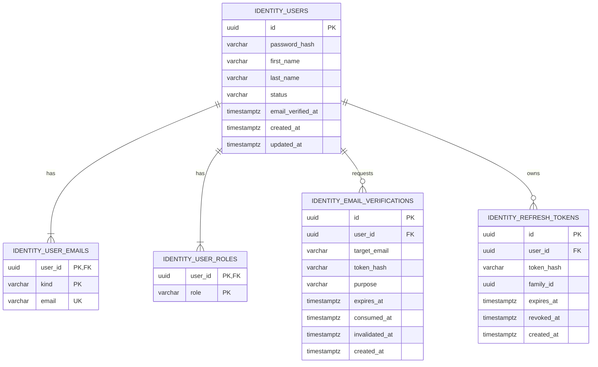

# Persistence и схема данных Identity

Схему создаёт Flyway. После применения миграций jOOQ генерирует Java-типы в `identity.infrastructure.persistence.data.generated`. Сгенерированные типы остаются внутренними для persistence.

## Связи таблиц



## `identity_users`

| Столбец | Тип | Null | Назначение |
|---|---|---|---|
| `id` | `uuid` | нет | Primary key агрегата User. |
| `password_hash` | `varchar` | нет | BCrypt hash. Открытый пароль никогда не сохраняется. |
| `first_name` | `varchar` | нет | Имя пользователя. |
| `last_name` | `varchar` | нет | Фамилия пользователя. |
| `status` | `varchar` | нет | `PENDING_VERIFICATION`, `ACTIVE`, `SUSPENDED`, `DEACTIVATED`. |
| `email_verified_at` | `timestamptz` | да | Время первого успешного подтверждения email. |
| `created_at` | `timestamptz` | нет | Время создания. |
| `updated_at` | `timestamptz` | нет | Время последнего изменения. |

Ограничения:

```text
PRIMARY KEY (id)
CHECK (status IN ('PENDING_VERIFICATION', 'ACTIVE', 'SUSPENDED', 'DEACTIVATED'))
```

## `identity_user_emails`

| Столбец | Тип | Null | Назначение |
|---|---|---|---|
| `user_id` | `uuid` | нет | Владелец email, FK на `identity_users(id)`. |
| `email` | `varchar` | нет | Нормализованный email. |
| `kind` | `varchar` | нет | `CURRENT` или `PENDING`. |

Ограничения:

```text
PRIMARY KEY (user_id, kind)
UNIQUE (email)
FOREIGN KEY (user_id) REFERENCES identity_users(id) ON DELETE CASCADE
CHECK (kind IN ('CURRENT', 'PENDING'))
CHECK (email = lower(email))
```

Составной primary key реализует требование `UNIQUE(user_id, kind)`: у пользователя может быть максимум один текущий и один ожидающий email. `UNIQUE(email)` резервирует адрес сразу для обоих состояний и защищает от конкурентной регистрации или смены email.

## `identity_user_roles`

| Столбец | Тип | Null | Назначение |
|---|---|---|---|
| `user_id` | `uuid` | нет | FK на пользователя. |
| `role` | `varchar` | нет | Значение `UserRole`. |

Ограничения:

```text
PRIMARY KEY (user_id, role)
FOREIGN KEY (user_id) REFERENCES identity_users(id) ON DELETE CASCADE
CHECK (role IN ('STUDENT', 'TUTOR', 'ADMIN'))
```

## `identity_email_verifications`

| Столбец | Тип | Null | Назначение |
|---|---|---|---|
| `id` | `uuid` | нет | Primary key verification aggregate. |
| `user_id` | `uuid` | нет | FK на пользователя. |
| `target_email` | `varchar` | нет | Email, который должен быть подтверждён. |
| `token_hash` | `varchar(64)` | нет | SHA-256 hash в hex/base64url-представлении. |
| `purpose` | `varchar` | нет | `REGISTRATION` или `EMAIL_CHANGE`. |
| `expires_at` | `timestamptz` | нет | Конец срока действия. |
| `consumed_at` | `timestamptz` | да | Время успешного использования. |
| `invalidated_at` | `timestamptz` | да | Время явного отзыва. |
| `created_at` | `timestamptz` | нет | Время выпуска. |

Ограничения и индексы:

```text
PRIMARY KEY (id)
FOREIGN KEY (user_id) REFERENCES identity_users(id) ON DELETE CASCADE
UNIQUE (token_hash)
CHECK (purpose IN ('REGISTRATION', 'EMAIL_CHANGE'))
CHECK (expires_at > created_at)
INDEX (user_id, purpose)
INDEX (expires_at)
```

При повторной отправке предыдущая активная verification того же пользователя и purpose получает `invalidated_at`. Поиск выполняется по hash; открытый token в SQL не попадает.

## `identity_refresh_tokens`

| Столбец | Тип | Null | Назначение |
|---|---|---|---|
| `id` | `uuid` | нет | Primary key состояния refresh token. |
| `user_id` | `uuid` | нет | FK на пользователя. |
| `token_hash` | `varchar(64)` | нет | SHA-256 hash; открытый token не сохраняется. |
| `family_id` | `uuid` | нет | Идентификатор цепочки ротации. |
| `expires_at` | `timestamptz` | нет | Конец срока действия. |
| `revoked_at` | `timestamptz` | да | Время отзыва/ротации. |
| `created_at` | `timestamptz` | нет | Время выпуска. |

Ограничения и индексы:

```text
PRIMARY KEY (id)
FOREIGN KEY (user_id) REFERENCES identity_users(id) ON DELETE CASCADE
UNIQUE (token_hash)
CHECK (expires_at > created_at)
INDEX (user_id)
INDEX (family_id)
INDEX (expires_at)
```

Ротация должна быть атомарной: текущий token блокируется/помечается отозванным и новый token той же family сохраняется в одной транзакции. Повторное предъявление уже отозванного token рассматривается как возможная кража и отзывает активные tokens этой family.

## Восстановление агрегатов

### User

`UserJooqRepository` загружает:

1. одну строку `identity_users`;
2. строки `identity_user_emails` для пользователя;
3. строки `identity_user_roles` для пользователя.

Эти данные объединяются в `UserPersistenceData`. Затем `UserPersistenceMapper` находит email с `kind=CURRENT`, необязательный `kind=PENDING`, преобразует роли и восстанавливает `User` через специальную reconstitution factory. Восстановление не создаёт новых domain events.

### EmailVerification

`EmailVerificationJooqRepository` возвращает internal generated record/POJO. `EmailVerificationPersistenceMapper` восстанавливает агрегат с исходными `consumedAt` и `invalidatedAt`.

### RefreshTokenState

`RefreshTokenJooqRepository` возвращает internal generated record/POJO. `RefreshTokenPersistenceMapper` преобразует его в application-модель `RefreshTokenState`.

## Транзакционные границы

| Use case | Атомарные изменения |
|---|---|
| Register | резервирование email, сохранение User, создание EmailVerification |
| Confirm registration email | consume verification, активация User, сохранение hash refresh token |
| Change email | резервирование pending email, сохранение User, создание EmailVerification |
| Confirm changed email | consume verification, перенос PENDING → CURRENT |
| Refresh | отзыв старого token, сохранение нового token той же family |
| Logout | отзыв найденного refresh token |

Письмо не отправляется через SMTP внутри транзакции Identity. Identity вызывает публичный gateway Notifications, который надёжно сохраняет запрос на доставку, а фактическая отправка выполняется асинхронно.

## Правила миграций и jOOQ

1. Flyway migration является источником истины для physical schema.
2. jOOQ code generation запускается после применения migration к generation database/schema.
3. `persistence.data.generated` не редактируется вручную.
4. Domain enums не передаются непосредственно в jOOQ records; преобразование выполняет mapper.
5. Database constraint violations преобразуются adapter-ом в application exception, например unique email → `EmailAlreadyExistsException`.
6. Время хранится как UTC-compatible `timestamptz` и представляется `Instant`.
