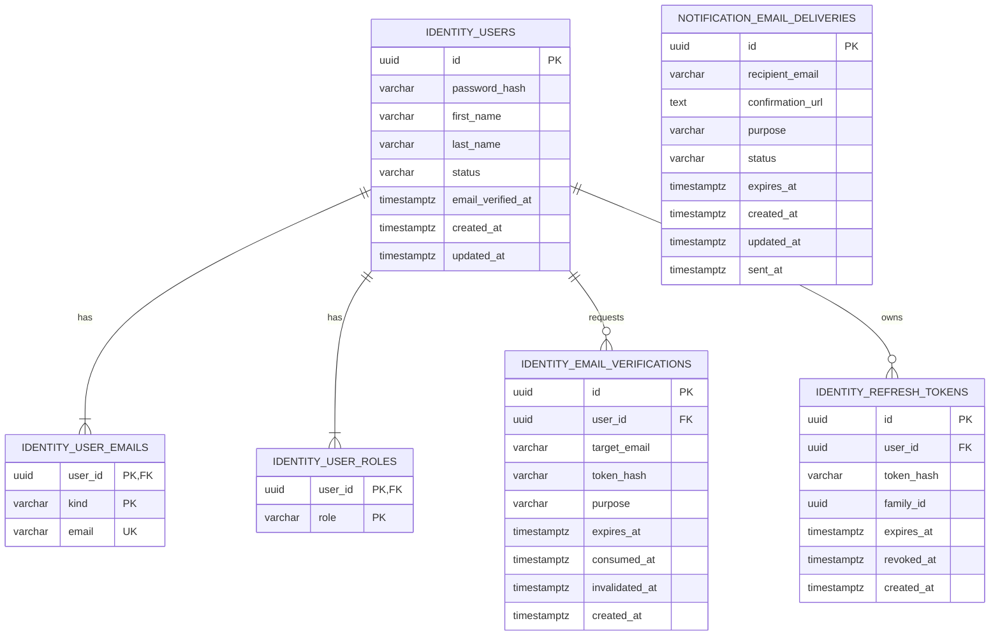

# Persistence и схемы данных Identity и Notifications

Схему создаёт Flyway. После применения миграций отдельные jOOQ executions
генерируют Java-типы Identity и Notifications в соответствующие внутренние
`infrastructure.persistence.data.generated` packages.

Generated-код обоих модулей хранится в `backend/src/generated/java`, который
подключён как дополнительный каталог основного `main` source set. Он фиксируется
в Git, поэтому обычная компиляция не зависит от доступности PostgreSQL. Обновление
выполняется отдельно задачами `jooqCodegenIdentity`, `jooqCodegenNotifications`
либо общей `jooqCodegen` при запущенной локальной БД с применёнными миграциями.

## Связи таблиц



## `identity_users`

| Столбец | Тип | Null | Назначение |
|---|---|---|---|
| `id` | `uuid` | нет | Primary key агрегата User. |
| `password_hash` | `varchar` | нет | BCrypt hash. Открытый пароль никогда не сохраняется. |
| `first_name` | `varchar` | нет | Имя пользователя. |
| `last_name` | `varchar` | нет | Фамилия пользователя. |
| `status` | `varchar` | нет | `PENDING_EMAIL_VERIFICATION`, `ACTIVE`, `SUSPENDED`, `DEACTIVATED`. |
| `email_verified_at` | `timestamptz` | да | Время первого успешного подтверждения email. |
| `created_at` | `timestamptz` | нет | Время создания. |
| `updated_at` | `timestamptz` | нет | Время последнего изменения. |

Ограничения:

```text
PRIMARY KEY (id)
CHECK (status IN ('PENDING_EMAIL_VERIFICATION', 'ACTIVE', 'SUSPENDED', 'DEACTIVATED'))
```

## `identity_user_emails`

| Столбец | Тип | Null | Назначение |
|---|---|---|---|
| `user_id` | `uuid` | нет | Владелец email, FK на `identity_users(id)`. |
| `email` | `varchar` | нет | Нормализованный email. |
| `kind` | `varchar` | нет | `CURRENT` или `PENDING`. |

Ограничения:

```text
PRIMARY KEY (user_id, kind)
UNIQUE (email)
FOREIGN KEY (user_id) REFERENCES identity_users(id) ON DELETE CASCADE
CHECK (kind IN ('CURRENT', 'PENDING'))
CHECK (email = lower(email))
```

Составной primary key реализует требование `UNIQUE(user_id, kind)`: у пользователя может быть максимум один текущий и один ожидающий email. `UNIQUE(email)` резервирует адрес сразу для обоих состояний и защищает от конкурентной регистрации или смены email.

При регистрации основной, но ещё не подтверждённый адрес сохраняется как `CURRENT`.
Подтверждённость выражают `identity_users.status` и `email_verified_at`, а не `kind`.
Login ищет только `CURRENT`; проверка занятости адреса охватывает `CURRENT` и
`PENDING`.

## `identity_user_roles`

| Столбец | Тип | Null | Назначение |
|---|---|---|---|
| `user_id` | `uuid` | нет | FK на пользователя. |
| `role` | `varchar` | нет | Значение `UserRole`. |

Ограничения:

```text
PRIMARY KEY (user_id, role)
FOREIGN KEY (user_id) REFERENCES identity_users(id) ON DELETE CASCADE
CHECK (role IN ('TEACHER', 'STUDENT'))
```

## `identity_email_verifications`

| Столбец | Тип | Null | Назначение |
|---|---|---|---|
| `id` | `uuid` | нет | Primary key verification aggregate. |
| `user_id` | `uuid` | нет | FK на пользователя. |
| `target_email` | `varchar` | нет | Email, который должен быть подтверждён. |
| `token_hash` | `varchar(64)` | нет | SHA-256 hash в lowercase hex-представлении из 64 символов. |
| `purpose` | `varchar` | нет | `REGISTRATION` или `EMAIL_CHANGE`. |
| `expires_at` | `timestamptz` | нет | Конец срока действия. |
| `consumed_at` | `timestamptz` | да | Время успешного использования. |
| `invalidated_at` | `timestamptz` | да | Время явного отзыва. |
| `created_at` | `timestamptz` | нет | Время выпуска. |

Ограничения и индексы:

```text
PRIMARY KEY (id)
FOREIGN KEY (user_id) REFERENCES identity_users(id) ON DELETE CASCADE
UNIQUE (token_hash)
CHECK (purpose IN ('REGISTRATION', 'EMAIL_CHANGE'))
CHECK (expires_at > created_at)
INDEX (user_id, purpose)
INDEX (expires_at)
```

При повторной отправке предыдущая активная verification того же пользователя и purpose получает `invalidated_at`. Поиск выполняется по hash; открытый token в SQL не попадает.

Активная verification имеет `consumed_at IS NULL`, `invalidated_at IS NULL`, `created_at <= now` и `expires_at > now`. Поиск по hash выполняет `SELECT ... FOR UPDATE`; последующий save изменяет только `consumed_at` и `invalidated_at`, сохраняя identity-поля verification неизменными. Массовая инвалидизация обновляет только активные записи указанного `user_id + purpose`.

Locking read, save и инвалидизация требуют внешнюю транзакцию (`Propagation.MANDATORY`). PostgreSQL `timestamptz(6)` сохраняет микросекундную точность, поэтому `Instant` с наносекундами при записи округляется до поддерживаемой БД точности.

## `identity_refresh_tokens`

| Столбец | Тип | Null | Назначение |
|---|---|---|---|
| `id` | `uuid` | нет | Primary key состояния refresh token. |
| `user_id` | `uuid` | нет | FK на пользователя. |
| `token_hash` | `varchar(64)` | нет | SHA-256 hash в lowercase hex-представлении из 64 символов; открытый token не сохраняется. |
| `family_id` | `uuid` | нет | Идентификатор цепочки ротации. |
| `expires_at` | `timestamptz` | нет | Конец срока действия. |
| `revoked_at` | `timestamptz` | да | Время отзыва/ротации. |
| `created_at` | `timestamptz` | нет | Время выпуска. |

Ограничения и индексы:

```text
PRIMARY KEY (id)
FOREIGN KEY (user_id) REFERENCES identity_users(id) ON DELETE CASCADE
UNIQUE (token_hash)
CHECK (expires_at > created_at)
INDEX (user_id, family_id)
INDEX (expires_at)
```

Составной индекс поддерживает операции со всеми сессиями пользователя по `user_id`
и отзыв конкретной token family по паре `user_id + family_id`. Ротация должна быть
атомарной: текущий token блокируется/помечается отозванным и новый token той же
family сохраняется в одной транзакции. Повторное предъявление уже отозванного token
рассматривается как возможная кража и отзывает активные tokens этой family в границах
её пользователя. Поиск для refresh выполняется по unique `token_hash` без фильтра
по `revoked_at`/`expires_at` и с `FOR UPDATE`; состояние оценивает application service.
Отозванные rows сохраняются как минимум до установленной retention boundary, чтобы
reuse можно было связать с владельцем и family.

## `notification_email_deliveries`

Таблица принадлежит модулю Notifications и создаётся миграцией
`V2__create_notification_delivery_queue.sql`. У неё намеренно нет foreign key на
`identity_users`: модули не связывают свои таблицы физическими ссылками, а уже
принятое задание доставки не зависит от дальнейшего жизненного цикла User.

| Столбец | Тип | Null | Назначение |
|---|---|---|---|
| `id` | `uuid` | нет | Primary key задания доставки. |
| `recipient_email` | `varchar(254)` | нет | Получатель verification-письма. |
| `confirmation_url` | `text` | да | Чувствительный delivery payload с raw token; обязателен только для активных состояний и затирается в конечном состоянии. |
| `purpose` | `varchar(32)` | нет | `REGISTRATION` или `EMAIL_CHANGE`. |
| `status` | `varchar(16)` | нет | `PENDING`, `PROCESSING`, `SENT`, `FAILED` или `EXPIRED`. |
| `expires_at` | `timestamptz` | нет | Точный deadline исходного verification token. |
| `created_at` | `timestamptz` | нет | Время постановки задания в очередь. |
| `updated_at` | `timestamptz` | нет | Время последнего перехода состояния; worker использует его для обнаружения зависшего `PROCESSING`. |
| `sent_at` | `timestamptz` | да | Время успешной доставки; присутствует только для `SENT`. |

Ограничения:

```text
PRIMARY KEY (id)
CHECK (purpose IN ('REGISTRATION', 'EMAIL_CHANGE'))
CHECK (status IN ('PENDING', 'PROCESSING', 'SENT', 'FAILED', 'EXPIRED'))
CHECK (expires_at > created_at)
CHECK (updated_at >= created_at)
CHECK (PENDING/PROCESSING содержит confirmation_url, конечное состояние не содержит)
CHECK (только SENT содержит sent_at)
```

Отдельные `attempt_count`, `available_at` и `lease_until` для MVP не хранятся.
Временная ошибка worker-а возвращает запись в `PENDING`, а следующая
попытка происходит на очередном общем цикле до `expires_at`. Зависший
`PROCESSING` определяется по `updated_at` и конфигурируемому processing timeout.
Кроме primary key дополнительных индексов пока нет: для одного MVP worker-а и
малого объёма очереди это сознательное упрощение. Индекс под polling/claim query
пересматривается перед несколькими instances или заметным ростом таблицы.

## Восстановление агрегатов

### User

`UserJooqRepository` загружает:

1. одну строку `identity_users`;
2. строки `identity_user_emails` для пользователя;
3. строки `identity_user_roles` для пользователя.

Эти данные объединяются в `UserPersistenceData`. Затем `UserPersistenceMapper` находит email с `kind=CURRENT`, необязательный `kind=PENDING`, преобразует роли и восстанавливает `User` через специальную reconstitution factory. Восстановление не создаёт новых domain events.

Чтение выполняется тремя отдельными запросами, чтобы соединение email и roles не размножало строки. `findByCurrentEmail` учитывает только `kind=CURRENT` для login, `findByAnyEmail` находит `CURRENT` или `PENDING` для verification flow, а `existsByEmail` проверяет оба вида, поскольку `PENDING` уже резервирует адрес.

При сохранении `identity_users` используется upsert по `id`, но неизменяемый `created_at` не обновляется. Email и роли синхронизируются дифференциально: удаляются исчезнувшие значения, затем добавляются или обновляются актуальные. При подтверждении нового email строка `PENDING` удаляется до обновления `CURRENT`, чтобы перенос не конфликтовал с `UNIQUE(email)`.

Read-only сценарии используют `findById`. Любой use case, изменяющий существующего пользователя, обязан вызвать `findByIdForUpdate` внутри своей транзакции. Сначала блокируется строка `identity_users` через `SELECT ... FOR UPDATE`, затем читаются email и roles. Все записи пользователя выполняются через `UserJooqRepository.save`, который сначала обновляет заблокированную головную строку; это сериализует конкурирующие изменения одного агрегата. `findByIdForUpdate` и `save` требуют уже существующую транзакцию (`Propagation.MANDATORY`), а не создают её внутри persistence.

### EmailVerification

`EmailVerificationJooqRepository` возвращает internal generated record. `EmailVerificationPersistenceMapper` восстанавливает агрегат с исходными `consumedAt` и `invalidatedAt`.

### RefreshTokenState

`RefreshTokenJooqRepository` возвращает internal generated record. `RefreshTokenPersistenceMapper` преобразует его в application-модель `RefreshTokenState`.

## Транзакционные границы

| Use case | Атомарные изменения |
|---|---|
| Register | резервирование email, сохранение User, создание EmailVerification и `PENDING` notification delivery |
| Confirm registration email | consume verification, активация User, сохранение hash refresh token |
| Change email | резервирование pending email, сохранение User, создание EmailVerification |
| Confirm changed email | consume verification, перенос PENDING → CURRENT |
| Refresh | отзыв старого token, сохранение нового token той же family |
| Logout | идемпотентный отзыв всей family предъявленного refresh token |

Письмо не отправляется через SMTP внутри транзакции Identity. Identity вызывает публичный gateway Notifications, который надёжно сохраняет запрос на доставку, а фактическая отправка выполняется асинхронно.

## Правила миграций и jOOQ

1. Flyway migration является источником истины для physical schema.
2. jOOQ code generation запускается после применения migration к generation database/schema.
3. `jooqCodegenIdentity` ограничен таблицами `public.identity_*`, а `jooqCodegenNotifications` — `public.notification_*`; служебная таблица Flyway не входит ни в одну generated model.
4. Генерируются table, record, schema, key и index types. jOOQ POJO и DAO не генерируются.
5. Результат сохраняется в `backend/src/generated/java`; `compileJava` не запускает `jooqCodegen` автоматически.
6. `persistence.data.generated` не редактируется вручную.
7. Domain enums не передаются непосредственно в jOOQ records; преобразование выполняет mapper.
8. Database constraint violations преобразуются adapter-ом в application exception, например unique email → `EmailAlreadyExistsException`.
9. PostgreSQL `timestamptz` представлен в generated records как `OffsetDateTime`; persistence mapper явно преобразует его в доменный `Instant` и обратно.
