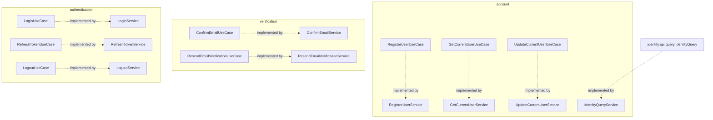
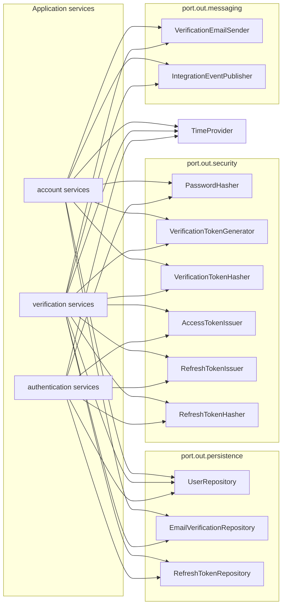
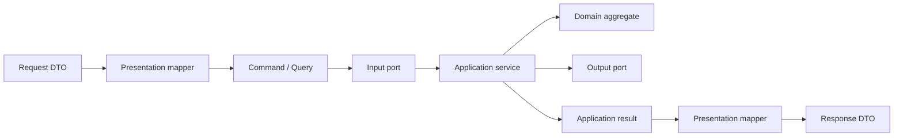

# Identity Application

## Входные порты и сервисы

## Выходные порты

Группы application services не соединены между собой. Общие операции доступны через output ports, domain behavior и mapper classes.

## Поток данных use case

