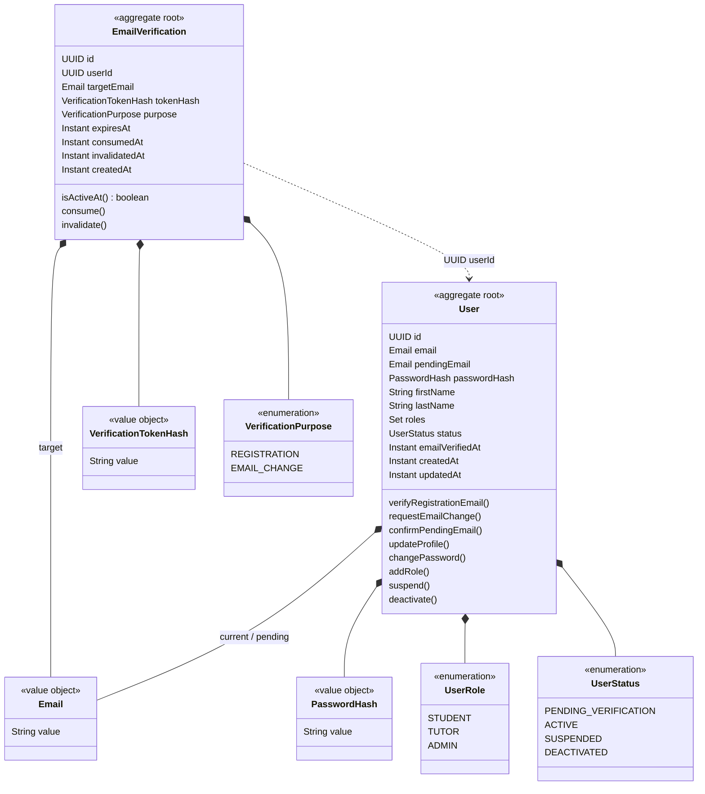
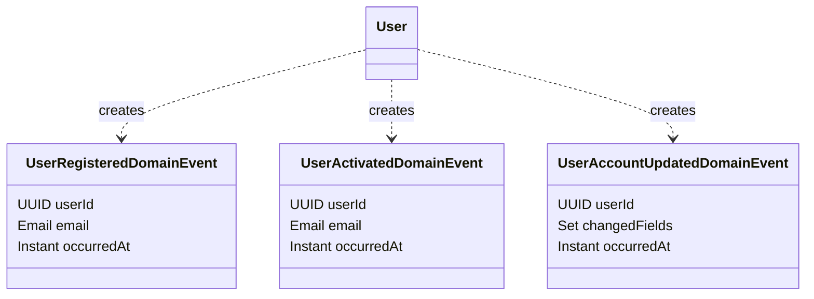

# Identity Domain

## Агрегаты и value objects

Пунктирная связь `EmailVerification ..> User` означает ссылку по идентификатору. Один aggregate root не хранит другой aggregate root в своём объектном графе.

## Доменные события

Domain events внутренние. `IdentityApiMapper` преобразует их в типы `identity.api.event` перед публикацией за границы модуля.
