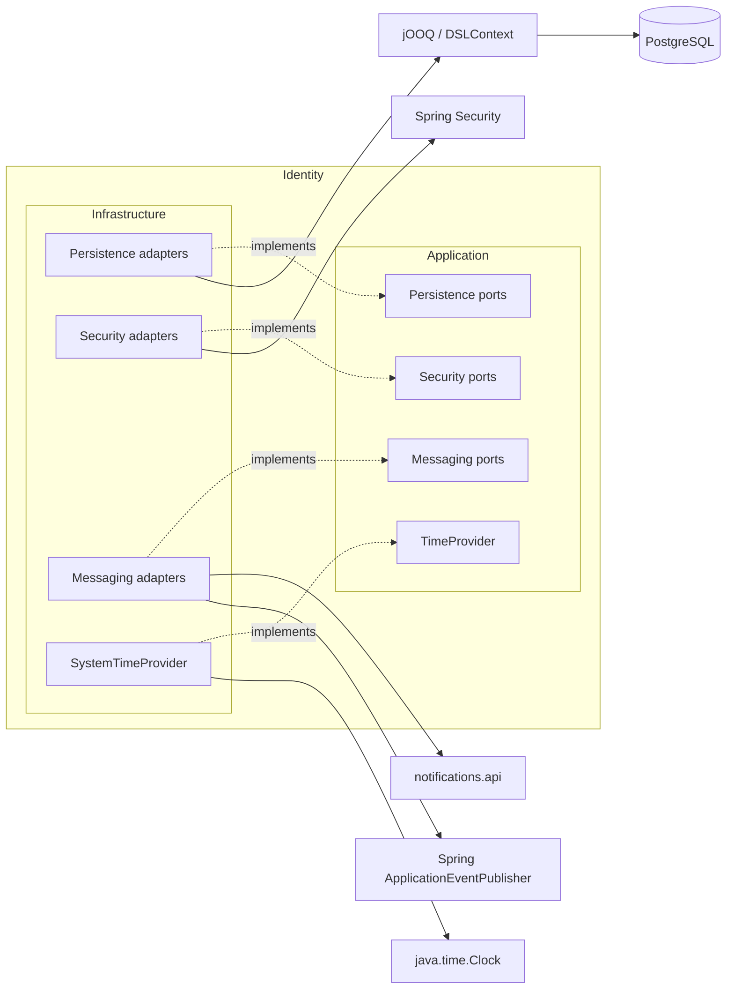

# Identity Infrastructure — Overview

Диаграмма показывает реализации выходных портов Application и внешние технологии.



```text
identity.infrastructure
├── persistence
│   ├── adapter
│   ├── mapper
│   └── data
├── security
│   ├── password
│   ├── token
│   ├── authentication
│   └── configuration
├── messaging
│   ├── email
│   └── event
└── time
```

Infrastructure знает интерфейсы Application и реализует их. Application не импортирует классы Infrastructure.
