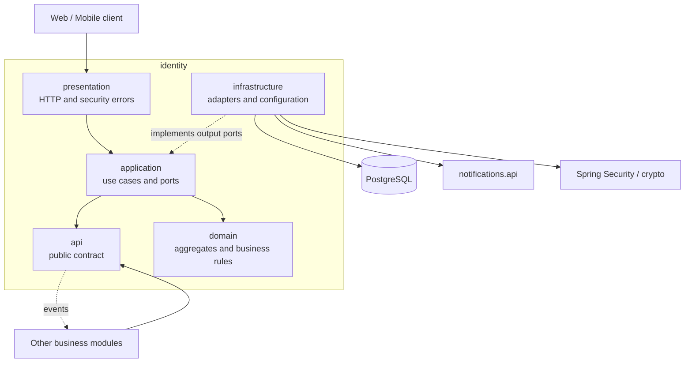

# Identity — Layers and Dependencies



## Правила

```text
PUBLIC:
  identity.api

INTERNAL:
  identity.presentation
  identity.application
  identity.domain
  identity.infrastructure

ALLOWED:
  presentation → application
  application → domain
  application → api
  infrastructure → application output ports
  infrastructure → domain/application models where adapter mapping requires them
  other modules → identity.api
  identity.messaging.email → notifications.api

FORBIDDEN:
  domain → Spring/jOOQ/application/infrastructure
  application → presentation/infrastructure
  presentation → infrastructure
  other modules → identity internal packages
  identity → notifications internal packages
```

Dependency Injection связывает input ports с application services и output ports с infrastructure adapters в runtime. Направление compile-time зависимости остаётся направленным к внутренним правилам и контрактам.
