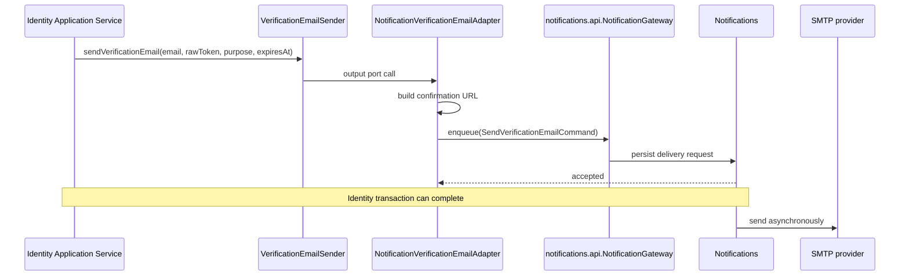
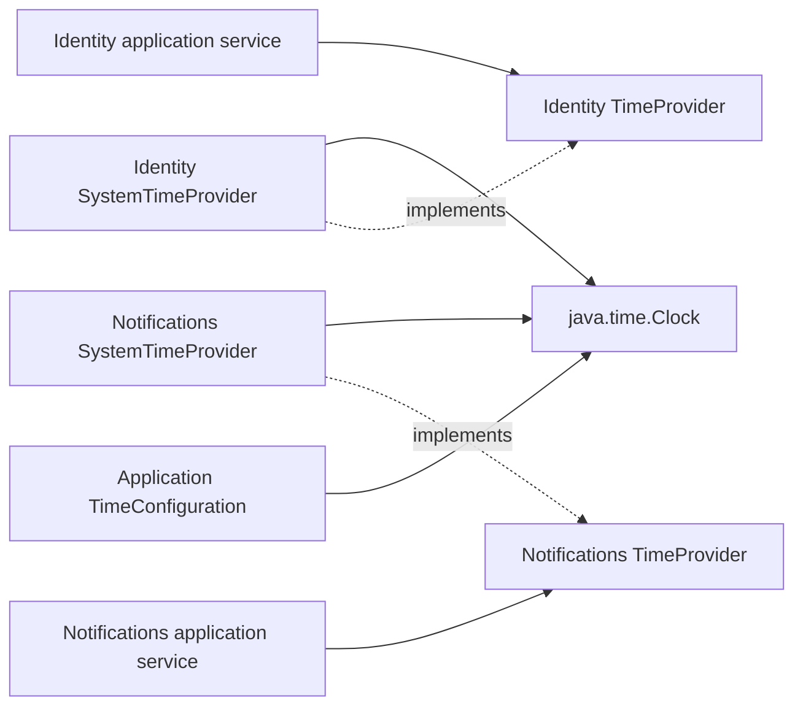

# Identity Messaging and Time

## Verification email

`NotificationVerificationEmailAdapter` формирует URL на основе
`IdentityNotificationProperties.frontendBaseUrl`. Пока реального frontend нет,
используется явно временный placeholder `http://frontend.example:3000` и путь
`/verify-email`; позже адрес заменяется только конфигурацией. `expiresAt` команды
равен deadline исходного verification token и позволяет Notifications не
отправлять истёкшую ссылку. HTML/text template, SMTP credentials, retry и
delivery status принадлежат Notifications.

Локально Spring Mail подключён к Mailpit (`localhost:1025`, UI
`localhost:8025`) исключительно для разработки. В production Mailpit не
используется: тот же Notifications SMTP adapter получает настройки внешнего
SMTP-провайдера и секреты из deployment environment.

Raw verification token не сохраняется в таблицах Identity. Реализованная delivery
queue хранит полный confirmation URL в `notification_email_deliveries` как
чувствительный payload до успешной отправки или `expiresAt`; такой payload нельзя
логировать. В конечном состоянии URL должен быть затёрт. Шифрование at rest
остаётся отдельным открытым усилением.

Для MVP очередь не хранит `attempt_count`, `available_at` и `lease_until`.
Временная ошибка worker-а возвращает задание в `PENDING`, после чего оно
повторяется на следующем общем polling cycle. Зависший `PROCESSING` будет
определяться по `updated_at` и processing timeout. MVP использует batch `10`,
poll/initial delay `10s`, processing timeout `1m` и один scheduler; решение
зафиксировано в `OPEN-018` как `RESOLVED`.

## Интеграционные события

Внутренние подписчики, которым нужны зафиксированные данные, обрабатывают событие после commit транзакции. Публичное событие не содержит domain objects.

`SpringIntegrationEventPublisher` передаёт тот же публичный Java event в
`ApplicationEventPublisher` без дополнительного mapping. Spring publication по
умолчанию синхронна и выполняется в памяти текущего процесса. Момент обработки
зафиксированных данных задаёт consumer через
`@TransactionalEventListener(phase = AFTER_COMMIT)`; это не делает обработку
асинхронной и не даёт durable delivery. Надёжный outbox остаётся отдельным
решением из `OPEN-011`.

## TimeProvider

`Clock` создаётся в application composition root и внедряется через конструкторы.
Production использует один UTC system clock, а каждый модуль сохраняет собственный
application port и adapter. В unit-тестах используются fixed/mutable clock или
fake `TimeProvider`. Production adapters обрезают наносекунды `Instant` до
микросекунд: это точность PostgreSQL `TIMESTAMPTZ`, поэтому один `expiresAt`
остаётся буквально одинаковым в HTTP-ответе и обеих module-owned таблицах.
