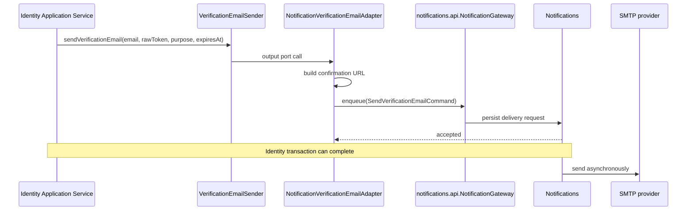
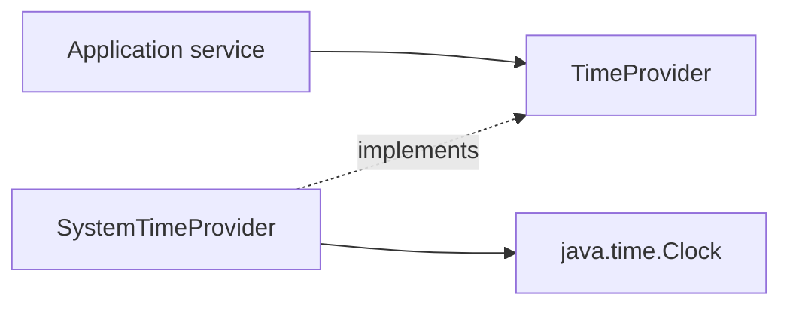

# Identity Messaging and Time

## Verification email

`NotificationVerificationEmailAdapter` формирует URL на основе `IdentityNotificationProperties.frontendBaseUrl`. HTML/text template, SMTP credentials, retry и delivery status принадлежат Notifications.

## Интеграционные события

```mermaid
flowchart LR
    DOMAIN[Domain event]
    MAPPER[IdentityApiMapper]
    PUBLIC[identity.api.event]
    PORT[IntegrationEventPublisher]
    ADAPTER[SpringIntegrationEventPublisher]
    SPRING[ApplicationEventPublisher]
    SUBSCRIBER[Other module subscriber]

    DOMAIN --> MAPPER
    MAPPER --> PUBLIC
    PUBLIC --> PORT
    PORT --> ADAPTER
    ADAPTER --> SPRING
    SPRING --> SUBSCRIBER
```

Внутренние подписчики, которым нужны зафиксированные данные, обрабатывают событие после commit транзакции. Публичное событие не содержит domain objects.

## TimeProvider

`Clock` внедряется через конструктор. Production использует UTC system clock, а тесты — fixed/mutable clock.
