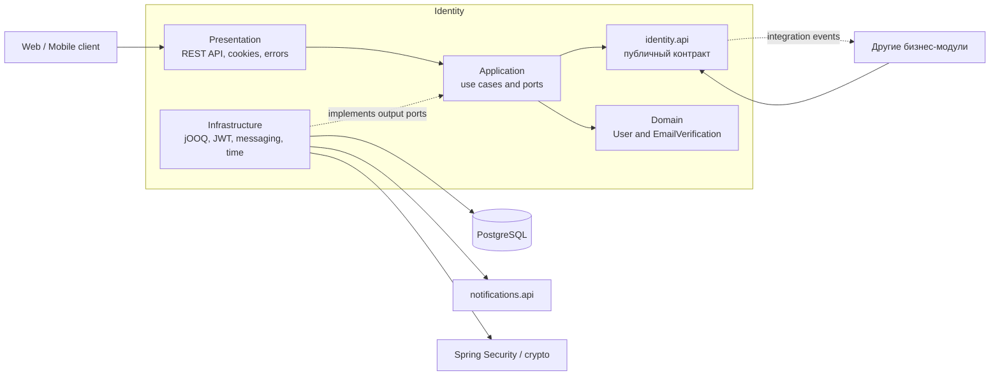

# Identity — общий вид

Модуль Identity отвечает за регистрацию, подтверждение email, аутентификацию, управление refresh sessions и основные данные учётной записи.



## Основные сценарии

```text
Регистрация
  → резервирование email
  → сохранение User
  → выпуск verification token
  → постановка письма в очередь Notifications

Подтверждение email
  → проверка verification token
  → активация User или применение pending email
  → выпуск access и refresh tokens

Login
  → проверка пароля и состояния аккаунта
  → выпуск access и refresh tokens

Refresh
  → проверка hash и состояния refresh token
  → отзыв старого token
  → выпуск новой пары с сохранением family

Изменение профиля
  → изменение имени/фамилии
  → резервирование pending email при смене адреса
  → новое подтверждение email
```

Другие модули не загружают aggregate roots Identity и не вызывают его repositories. Для синхронного чтения они используют `IdentityQuery`, а для реакции на изменения — события `identity.api.event`.
