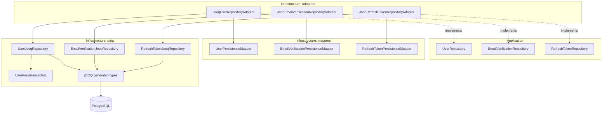
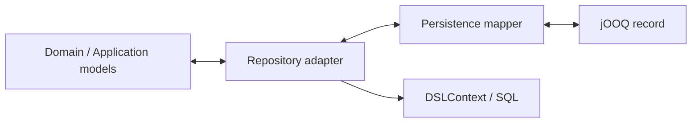

# Identity Persistence — jOOQ

## Граница типов

jOOQ records завершают свой жизненный цикл внутри persistence. `UserJooqRepository` работает с `UserPersistenceData` и generated types и не знает агрегат `User`.

Подробная physical schema находится в [описании базы данных](../catalog/database.md).
