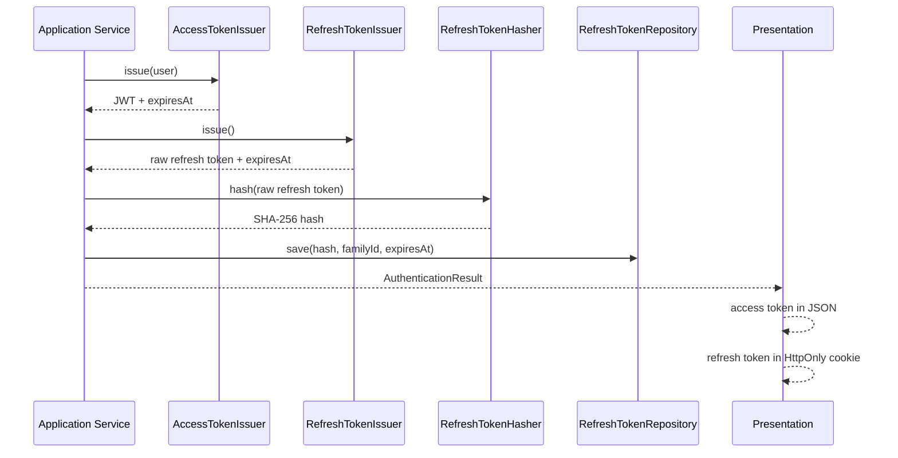
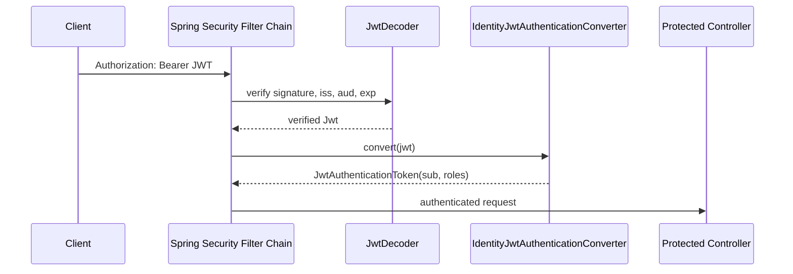
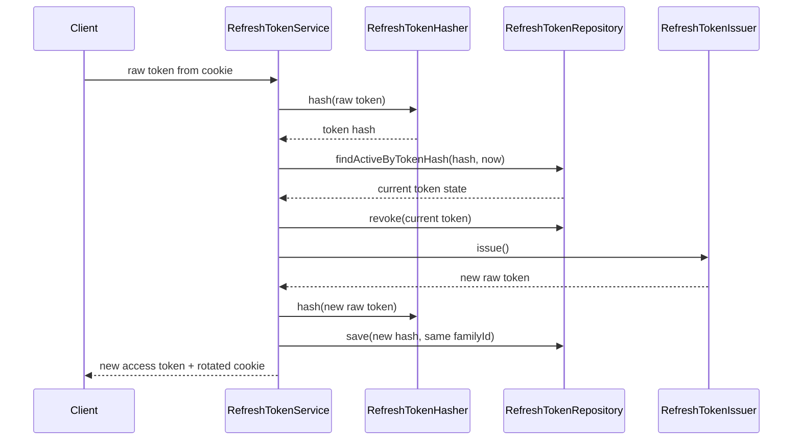

# Identity Security — JWT and Tokens

## Выпуск пары токенов



## Проверка access JWT



Проверка JWT не обращается к PostgreSQL на каждом запросе. Краткий срок жизни access token ограничивает время действия уже выданных claims.

## Ротация refresh token



## JWT claims и cookie

```text
JWT algorithm: RS256
JWT claims: sub, roles, iss, aud, iat, exp
Signing private key: external configuration / secret storage
Verification public key: JwtDecoder configuration

Refresh cookie:
HttpOnly = true
Secure = true in production
SameSite = Lax
Path = /api/v1/auth
Max-Age = refresh token lifetime
```

CORS разрешает только настроенные frontend origins. Предполагается размещение frontend и backend в пределах одного site.
